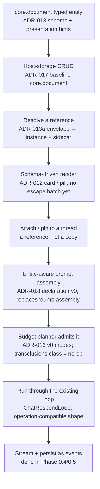

# Handoff — The Vertical Spine, on `core.document` (Track A, part 1)

Build the first vertical cut through the typed-context layer **against a host-native
`core.document` entity** — typed entity → schema render → reference resolution → attach →
entity-aware prompt assembly → budget → the existing turn loop → stream. This proves the
product thesis end to end **without opening the ADR-010 process boundary**. Opening
ADR-010 and adding Hypomnema as the first *external* provider is the next slice (part 2),
deliberately deferred so the spine isn't hostage to the separate Hypomnema project.

This is a **build plan** session: produce the numbered path below with a concrete
interface contract at each step, then build it.

## The path

## Inputs to load

- ADR-003 (typed entities / provider pattern), ADR-012 (schema-driven rendering + the
  deferred code escape hatch), ADR-013 + ADR-013a + `design-notes/reference-envelope.md`
  (envelope, hints, the reference shape), ADR-016 + `design-notes/context-window-management.md`
  (budget modes), ADR-017 + `design-notes/artifact-capabilities-walkthrough.md` (the
  baseline host-storage `core.document`), ADR-018 + `design-notes/prompt-declaration-walkthrough.md`
  (prompt declaration), ADR-014 (the operation shape — *not* the registry).
- `handoffs/handoff-vertical-slice.md` — the original step-5 brief; this handoff is its
  `core.document`-first variant. **Honor its transclusion guardrail (below).**
- `src/Ai/Chat/ChatRespondLoop.php` — the operation-compatible loop whose "dumb prompt
  assembly" this slice replaces with entity-aware assembly.
- F1 taxonomy (the `task.chat` profile `response.generate` resolves).

## Decisions to land

1. **`core.document`-first (decided in the roadmap).** Build the entire spine against the
   host-native baseline `core.document` (ADR-017) — no ADR-010, no JSON-RPC, no external
   process. One entity type only.
2. **Reuse the existing loop; do NOT build the ADR-014 registry.** `ChatRespondLoop` is
   already shape-compatible with `core.chat.respond`. This slice swaps its dumb prompt
   assembly for **entity-aware assembly**; it does not build the operation registry
   (that's F2). Keep the call/return shape registry-adoptable.
3. **Schema-driven rendering only (ADR-012).** Render `core.document` as card/pill from
   its schema + presentation hints. **No code escape hatch** — but start the ADR-012
   "when does the generic renderer pinch?" evidence list.
4. **Budget v0 (ADR-016).** Admit the one attached document under the simple budget modes
   (`full` for small, degrade to `summary`/`reference` for large). No async compaction.
5. **Prompt declaration v0 (ADR-018).** A lean, host-planned assembly that pulls attached
   entities as context grants. Minimal — not the full ordering/cache-breakpoint machinery.
6. **Write path: minimal.** At most one `core.document` create/update to close the loop
   (per the vertical-slice handoff). No bulk, no full ADR-017 capability surface.

## Transclusion guardrail (load-bearing — from the vertical-slice handoff, do not skip)

Transclusion is deferred, but its seam stays open here. Two non-negotiables:
1. **Serialization routes through the expansion-policy slot** (`pill | summary | full`
   from the reference envelope, ADR-013a). The slice implements only `pill`/reference but
   **routes through the slot** — never hardcodes "references are pills, full stop."
2. **Keep ADR-016's `transclusions` budget class as a no-op placeholder** rather than
   omitting it. Admitting zero transcluded tokens today is fine; deleting the class means
   re-architecting admission when transclusion returns.

Hold these and reviving transclusion is an additive ADR; drop them and it's a wire-format
migration.

## Scope — build plan with interface contracts (produce these)

For each step, name the contract (types in/out, the seam to the next step):
1. **`core.document` type declaration** — ADR-013 JSON Schema + presentation hints +
   routing envelope; the fields a document carries; what `kind`/capabilities it advertises
   (ADR-017).
2. **Host-storage CRUD** — persistence for `core.document` (Doctrine), read by id,
   minimal create/update.
3. **Reference resolution** — given a reference envelope (ADR-013a), return the resolved
   instance + sidecar; exercise the `resolved` / dangling paths.
4. **Schema-driven renderer** — schema + data → card/pill view; the leaf-renderer seam the
   SPA (Track D) plugs into.
5. **Attach/pin** — associate a document *reference* with a thread (event-sourced, like
   the rest of the conversation log); the attach list above the composer.
6. **Entity-aware prompt assembly** — replace `ChatRespondLoop`'s dumb assembly: pull
   pinned references as context grants, serialize through the expansion-policy slot,
   admit via the budget planner.
7. **`response.generate` (operation-shaped, on the existing loop)** — resolve the
   `task.chat` profile (F1), run, stream, persist (done).

## Hard exclusions (keep the slice thin)

- **No ADR-010 / JSON-RPC / Hypomnema / external providers** — that's part 2.
- **No transclusion expansion** — the `pill` slot only; the slot is routed, not honored
  beyond `pill`.
- **No Operation Registry build (ADR-014)** — reuse the loop's compatible shape.
- **No suggestion engine, no attach picker UX beyond the minimum, no citation pills** —
  those are Track D / later.
- **No second entity type, no multi-user, no branching.**
- **No full ADR-018 ordering/cache-breakpoint machinery, no async ADR-016 compaction.**

## What the slice is designed to surface

- Where the **schema-driven renderer pinches** (ADR-012 escape-hatch evidence list — first
  entry, even if "renderer held").
- Whether the **reference envelope** (ADR-013a) holds in code, not just on paper.
- **Budget admission** edge cases under a real document + real token counts (ADR-016).
- Whether **entity-aware assembly** cleanly replaces the dumb path without disturbing the
  Phase 0.4/0.5 streaming + failure behavior.

## Definition of done

- [ ] A running slice (or a build plan with the interface contract at each numbered step).
- [ ] `core.document` is declared (ADR-013 schema + hints), host-stored, resolvable via the
      reference envelope, and schema-rendered as a card/pill.
- [ ] A document reference can be **attached to a thread** and is serialized into the
      prompt **through the expansion-policy slot**; `transclusions` budget class present
      as a no-op.
- [ ] The turn runs through the existing loop with **entity-aware assembly**; Phase 0.4/0.5
      streaming + `assistant_turn_failed` behavior unchanged; `make test`/`make lint` green.
- [ ] First entry in the ADR-012 escape-hatch evidence list.
- [ ] Uses the F1 `task.chat` profile for the model call.

## Downstream

- **Part 2 — open ADR-010 + Hypomnema** as the first *external* provider over JSON-RPC;
  the same resolve/render/attach/serialize seams now cross a process boundary (the real
  extensibility-without-forking test).
- **Track D** renders `core.document` cards/pills in the SPA via the leaf-renderer seam
  from step 4.
- **Track B** — a second provider, the operation registry (F2), suggestions, artifacts
  (ADR-017 write path), and `core.memory` all build on the typed-entity machinery this
  slice establishes.
