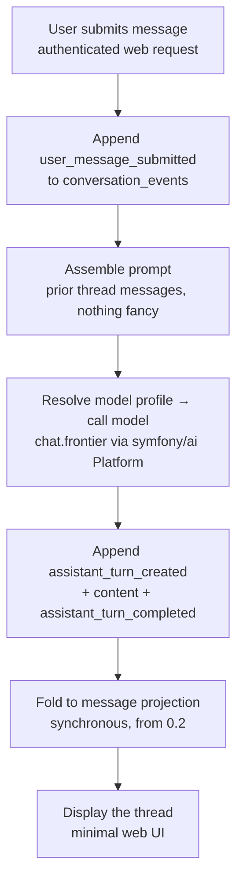

# Handoff — Minimal Turn Loop (Phase 0.3)

Close the loop: a logged-in user submits a message, the host calls the model, and the
assistant's reply is persisted as events, folded to the projection, and displayed. This is
the first *running* thing and the end of Phase 0 — after this you have the base step 5 needs.

## The loop

## Inputs to load

- 0.0 (`symfony/ai` Platform + provider bridge, transport), 0.1 (the authenticated
  user/tenant), 0.2 (event store + projections, and the event-sourcing-from-day-one decision).
- ADR-008 (provider/model is backend; no user-facing picker) and ADR-014 (operation registry
  + model profiles) — for the profile-resolver and seam notes below, not to build in full.
- `design-notes/event-sourced-conversations.md` (event types this loop emits).

## Decisions to land

1. **Model-profile resolver — the first cut of the abstraction.** This loop is where the
   ADR-014 model-profile concept gets its first concrete (deliberately simple)
   implementation, and the seed of the "model router" ADR-018 presupposes. Build a thin
   host-owned resolver: a profile name (`chat.frontier`, …) → a `symfony/ai` Platform +
   `Model` selection, sourced from config. The loop asks for `chat.frontier`; the resolver
   decides which provider/model backs it. Keep it minimal — a config map is enough for v0 —
   but make the *interface* the real seam, because every later operation (extraction,
   summarization, embeddings) resolves models the same way.
   - **Fine-grained selection is operator/config-level, not user-facing.** Per ADR-008 the
     end user never picks a model; "fine-grained" here means an operator (and later
     tenant/admin policy) can map each profile to a different provider/model/version. The
     user-facing picker stays ruled out. If you meant something more end-user-exposed, flag
     it — it would be a change to ADR-008.
2. **Operation seam (defer the registry, keep the shape).** The loop is a stripped precursor
   of the `core.chat.respond` operation. Building the full ADR-014 registry now is scope
   creep. *Lean:* implement the loop as a plain service whose call/return shape is compatible
   with later registration as an operation — same inputs (request context, prior turns), the
   same model-profile request, and the same usage/token capture (`symfony/ai` surfaces token
   usage), just not yet routed through a registry. This is the "design the seam, defer the
   implementation" principle applied; note it so the later registry adoption is additive.
3. **Streaming: non-streaming first.** Get the full request → complete response → events
   path closed and correct before adding token deltas. Then add streaming (the Platform
   supports it) over the 0.0 transport as a fast-follow, emitting `assistant_content_delta`
   events as they arrive. Record both the v0 (non-streaming) state and the follow-up.
4. **Prompt assembly is deliberately dumb.** Concatenate the thread's prior messages in
   order. No budget planner, no summarization, no truncation strategy — if the thread gets
   long enough to overflow, that's fine for v0 and is exactly what ADR-016 exists to solve
   later. Do not build any of ADR-016 here.

## Hard exclusions (these are step 5 and beyond)

- **No ADR-010 extension boundary** — the model call goes straight through the `symfony/ai`
  Platform from the host, not through the JSON-RPC extension surface. No Hypomnema, no
  context providers. (Note: "provider" here is overloaded — a `symfony/ai` *model provider*
  like OpenAI/Anthropic is fine and expected; what's excluded is the ADR-010 *context
  provider* boundary.)
- No attached entities, no entity rendering, no reference envelope.
- No budget planner (ADR-016), no prompt declarations (ADR-018), no operation registry
  (ADR-014) — only the compatible call shape from decision 2 and the minimal profile
  resolver from decision 1.
- No suggestions, no branching, no multi-user beyond the single console-minted user.

## End state — the "base to work from"

A single console-minted user can hold a multi-turn text conversation with the assistant in a
minimal web UI, fully persisted as an event log and folded to projections, tenancy-scoped.
That is precisely the substrate step 5 builds on: the slice swaps the "dumb prompt assembly"
for entity-aware assembly, adds the provider boundary and schema rendering, and routes the
model call through the real `response.generate` operation.

## Downstream

- Step 5 (vertical slice) — replaces prompt assembly internals and adds the entity/provider
  layer on top of this loop.
- Later: registering `core.chat.respond` as a real ADR-014 operation; growing the minimal
  profile resolver into the full tenant/admin-policy model router (ADR-014/018); streaming
  hardening (reconnect/replay) against the 0.0 transport.

## Definition of done

- [ ] Submitting a message produces a persisted assistant reply via a real model call
      resolved through the profile resolver (`chat.frontier` → a `symfony/ai` bridge).
- [ ] The full turn is written as events and folded to the message projection.
- [ ] A multi-turn exchange displays correctly in the minimal UI.
- [ ] The loop service's shape is operation-compatible (decision 2) and documented as such.
- [ ] The profile resolver swaps providers via config alone (verify by pointing
      `chat.frontier` at a second bridge with no code change).
- [ ] Non-streaming v0 recorded; streaming fast-follow captured as the next task.
