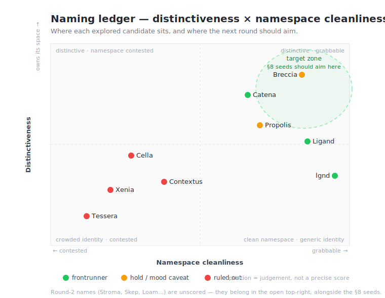

# Project Naming — Re-Seed Handoff

**Purpose.** This document lets a fresh session re-run the naming exploration for the host application *from scratch*, but along **different metaphor seeds**, without losing any of the reusable scaffolding: what the thing is, how Beau's naming aesthetic works, the method, the availability-checking toolkit, and a ledger of what's already been explored (so the new run diverges instead of repeating dead ends).

Working placeholder name today: **`bug-free-happiness`** (a GitHub auto-generated suggestion — not a real candidate).

---

## 1. What is being named

A **personal-first AI workspace** — a Symfony-based, multi-user system intended to replace day-to-day reliance on a licensed commercial AI chat product (*Iris*). Its defining architectural commitment is **extensibility-without-forking**: the system is extended by separate processes over JSON-RPC with capability negotiation, never by editing host source code.

Shape of the thing, for naming purposes:

- It is a **host** that aggregates **typed context entities** from multiple **providers** and presents them through a host-mediated extension surface.
- *Hypomnema* (an Obsidian vault integration) is the first context provider; **GitHub** and **Linear** integrations are planned.
- It holds host-native primitives (e.g. a polymorphic **Project**), renders typed entities via a JSON-Schema + presentation-hints system, and exposes artifacts/documents.
- Deployment targets: personal (Docker Compose via Coolify Cloud → Hetzner) and, later, **air-gapped internal team** use.

**The one-line essence for naming:** *the connective tissue that gathers many typed fragments from many providers and binds them into one coherent, coordinated whole.*

---

## 2. The central naming insight (most reusable nugget)

Every metaphor that fits this project has the **same deep structure**: discrete **typed units** plus a **binding / coordinating medium**.

| Domain | The units | The binder (= the host) |
|---|---|---|
| Geology | clasts (fragments) | cement / matrix |
| Mosaic | tesserae (tiles) | grout |
| Beehive | cells | propolis (bee glue) |
| Chemistry | ligands / ions | the coordination complex |
| Forest | trees | mycelium / mycorrhiza |
| Crystal | atoms | the lattice / bonds |

**Beau's host application is the binder, not one of the units.** So the strongest names point at *the connective/coordinating medium*, not at an individual fragment. This is the lens to carry into any new seed: for each vein, find the word for *what holds the pieces together*.

A secondary insight that resolved a lot: **connotation matters as much as structure.** Breccia is structurally perfect but its mood is *violent fracture / salvaged rubble*; the honeycomb / network / coordination metaphors carry the same structure with an *ordered, emergent, communal* mood that better fits the project's hospitality-to-guests spirit.

---

## 3. Beau's naming aesthetic (the "grammar")

Reverse-engineered from his existing names. A good candidate should feel like it belongs in this set.

- **Classical roots, lightly scholarly.** Greek/Latin words a classicist would recognize but a PM wouldn't. Etymologically rich; meant to "remain useful over long periods without re-translation."
- **Roots that name an action or a state done to material**, not mascot-nouns. (cut, cleave, foretell, a stable disposition, a broken fragment.)
- **Styling is an adjustable knob**, applied to a single root:
  - Full word — `Hypomnema`, `Chronicle`
  - Terse lowercase — `clast`
  - **Disemvoweled** — `prtend`, and the variant tokens he tests (`prpls`, `ctn`, `lgnd`)
  - Capitalized coinage — `Scind`, `Hexist`
- **Two extra registers are in-bounds**, taken from his heavy-use tools: **mineral/material nouns** (`Obsidian`) and **deity-nouns** (`Iris`, messenger goddess).
- **Single words.** Distinctive, low-collision, quietly meaningful rather than descriptive.

### Existing-name corpus (with best-guess readings)

Readings of his own coinages are *inferences*, not confirmed glosses.

| Name | Likely root / meaning | Role |
|---|---|---|
| **Hypomnema** | Gk *hypomnēma*, a notebook / reminder for self-formation | Obsidian-vault context provider |
| **Chronicle** | *khronos*, a record across time | Other project |
| **clast** | Gk *klastos*, a broken rock fragment | Other project |
| **prtend** | disemvoweled *portend* / *pretend* (*-tendere*, stretch toward) | Other project |
| **Scind** | L *scindere*, to cut / cleave / split | Idea in play |
| **Hexist** | *hex*/hexagon, or Gk *hexis* (a stable acquired disposition) | Idea in play |
| **Iris** | Gk goddess, messenger / conduit | Heavy-use tool (licensed; study only) |
| **Obsidian** | volcanic glass — dark, sharp, reflective | Heavy-use tool (note-taking) |

### Naming constraints carried forward

- **Avoid the memory / notes / time veins** — `Hypomnema` and `Chronicle` already own those, and the host shouldn't collide conceptually with its own providers.
- **No migration-shaped language around Iris.** Iris is studied under a license that permits educational study but forbids redistribution / competing-product creation. Reference study only.
- **PHP / Packagist availability is the priority registry** (the stack is PHP/Symfony/Doctrine). crates.io is checked too but matters less; npm matters only if a JS package ships.

---

## 4. The seeds already used this round

Beau's stated meaning interests for the current exploration:

> substrate · binding molecules · coordinating disparate concepts · beehives · hive minds · hexagonal designs (visually and technically)

A fresh run should treat these as **already-mined** and reach for *new* veins (see §8).

---

## 5. Methodology (repeat this shape)

1. **Reverse-engineer the aesthetic grammar first** (§3) before proposing anything.
2. **Surface the structural insight** (§2) and use "name the binder" as the generative lens.
3. **Generate candidates in clustered metaphor veins**, each with etymology + why it fits *this* project + which styling knob it suits.
4. **Interview-style convergence:** present options and tradeoffs; let Beau pick veins/finalists rather than declaring a single answer early.
5. **Run the conflict matrix** (§6/§7) on finalists *and their disemvoweled variants*.
6. **Honest assessment over flattery** — if his favorite has problems (e.g. `Cella`), say so plainly and in prose, with mitigations.
7. **Use a visual.** Beau is a visual thinker; a metaphor map works well. The honeycomb diagram (cells = candidate names colored by vein, center cell = "the host = the binder") was effective and on-theme — reuse or vary it (quadrant chart of distinctiveness × availability is a good alternative).

---

## 6. Availability-checking toolkit (copy-paste reusable)

Sandbox network allows direct hits to crates.io, npmjs, PyPI, and github.com. Packagist, Docker Hub, and whois/registrar endpoints are **not** reachable from the sandbox — use `web_search` for those.

```bash
# crates.io  (200 = taken, 404 = free); plus namespace crowding count
curl -s -o /dev/null -w "%{http_code}" "https://crates.io/api/v1/crates/NAME"
curl -s "https://crates.io/api/v1/crates?q=NAME&per_page=1"   # .meta.total

# npm  (200 = taken); inspect what holds it (desc / last-modified / versions)
curl -s "https://registry.npmjs.org/NAME"
curl -s "https://registry.npmjs.org/-/v1/search?text=NAME&size=5"

# PyPI
curl -s "https://pypi.org/pypi/NAME/json"            # 'info' present = taken

# GitHub org/handle  — use the HTML endpoint, NOT the API
curl -s -o /dev/null -w "%{http_code}" -A "Mozilla/5.0" "https://github.com/NAME"
#   api.github.com rate-limits unauthenticated calls (60/hr) and returns 403 in bulk;
#   github.com/NAME returns 200 (taken) / 404 (free) reliably.

# Domains — A-record signal only (no dig/whois in sandbox)
getent hosts NAME.app | awk '{print $1}'             # empty ≈ maybe free
```

For everything the sandbox can't reach:

- **Packagist** (most important): `web_search "packagist NAME composer"`. Namespace is `vendor/package`, so what matters is whether the **vendor** name is free.
- **Docker Hub:** `web_search "docker hub NAME image"`. Low-stakes — images live under your own namespace.
- **Domains:** A-record absence (`no A record`) means *possibly* registrable, **not confirmed** — verify with a real registrar/whois/RDAP lookup outside the sandbox. Premium TLDs (`.io`, `.dev`, `.app`, `.com`) are almost always gone for real words; short brandable TLDs (`.sh`, `.host`) sometimes survive.
- **Brand / SEO collision:** always `web_search` the bare name for a *dominant existing project or company*, separate from registry checks. A free crate name is worthless if one famous project owns the search results.

### Gotchas learned

- **Short tokens (2–4 chars) are gold dust** — `xn`, `xen`, `tess`, `brc`, `ctn` were taken essentially everywhere. Don't invest hope in them.
- A name can be **free on every registry yet owned in brand space** (see `lgnd`).
- A name can be **structurally perfect yet wrong in mood** (see `Breccia`).
- The **disemvoweled variant often clears registries the full word can't** — always check it.

---

## 7. Explored-candidate ledger (avoid re-deriving these)

### Round 1 — first four
| Name | Vein | Verdict | Decisive conflict |
|---|---|---|---|
| **Xenia** | host/hospitality (Gk host-guest bond) | ✗ out | Xbox 360 emulator dominates dev search |
| **Tessera** | mosaic tile | ✗ out | Crowded; `tessera/tessera` is a Laravel-**AI** platform; AI-workspace + AI-memory namesakes |
| **Contextus** | "context," woven-together | ✗ weak | Saturated `context*` LLM neighborhood; npm + GitHub taken |
| **Breccia** | geology: cemented fragments | ◐ hold | Cleanest of the four (only niche namesakes); rhymes with `clast`; but "fracture/rubble" mood felt off |

### Round 2 — meaning expansion (the honeycomb set)
Propolis · Stroma · Catena · Mycelium / Mycorrhiza · Cella · Skep · Apiary · Ligand · Loam · Hexad · (Cella favored emotionally).

### Round 3 — shortlist matrix
| Name | Verdict | Key finding |
|---|---|---|
| **Propolis** | ◐ | Lovely meaning, clean on crates/Packagist/domains — but collides with `oxidecomputer/propolis`, a known Rust hypervisor that is *also* a host |
| **Catena** | ✓ strong | **Structurally cleanest** — no dominant software namesake, crate + Packagist vendor likely free; meaning = a chain linking sources (chemistry *catenation* + scholarly *catena* of excerpts). Ding: `.dev/.app/.io` gone (`.sh` free) |
| **Cella** | ✗ crowded | His favorite, best triple-meaning (temple chamber / honeycomb cell / biological cell), but `microsoft/cella`, `cellajs/cella` (active web-app framework), and a PHP e-commerce `Cella` all exist; crates + npm taken |
| **Ligand** | ✓ viable | GitHub org **free**; distinctive; chemistry/coordination meaning fits — but carries chem/pharma gravity |

### Round 4 — deep dive: `ligand` vs `lgnd`
- **`lgnd`** — namespace **pristine everywhere** (crates/npm/PyPI/GitHub/Packagist all free; zero `lgnd` crates). But **brand space is crowded**: 🚩 **LGND AI** (a funded geospatial-AI company on `lgnd.io` shipping dev SDKs), a creative agency on `lgnd.com`, streetwear brands. "LGND" = "legend," a popular acronym. Premium domains gone; `lgnd.dev`/`lgnd.sh` maybe open.
- **`ligand`** — GitHub org + Packagist vendor + PyPI + bare crate **free**; npm bare name held by a *dead* 0.0.6 chem-graphics package. `ligand.app` / `ligand.sh` appear open. Brand gravity: Ligand Pharmaceuticals (ticker **LGND**) + cheminformatics association.
- **Recommendation given:** brand **`Ligand`** publicly (legible, brandable, no AI-company clash) and use **`lgnd`** as the short token for vendor / CLI / repo prefix (spotless namespace, matches the disemvoweling aesthetic). Or go pure `lgnd` eyes-open about LGND AI.

**Current frontrunners at handoff:** `Catena` and `Ligand`/`lgnd`, with `Breccia` and `Cella` as sentimental holds.

### Map: the ledger as a quadrant



Two axes: **namespace cleanliness** (can you actually grab the registries/domains) on X, **distinctiveness** (does it own its search/brand space, free of a dominant namesake) on Y. The **top-right** is the goal — distinctive *and* grabbable. `Breccia` and `Catena` sit closest to it; `Ligand`/`lgnd` are far-right (very clean) but pulled down by chem/pharma and the LGND-AI brand; the ruled-out names cluster bottom-left. The dashed **target zone** is where the §8 divergent seeds should aim. Round-2 names (`Stroma`, `Skep`, `Loam`…) are unscored and belong in that same open top-right — they're the cheapest gaps to probe next. Positions are judgement calls, not precise scores.

---

## 8. Divergent seeds to try next (the point of a re-seed)

Veins **not yet mined**, each still obeying "name the binder" and the §3 constraints. Start a fresh run here for genuinely new candidates.

- **Mathematics / "local data glued into a global whole."** e.g. **Sheaf** — the precise mathematical object for local pieces consistently glued over a space; uncannily exact for typed entities federated into one context. (Check collisions.) Also: *Atlas* (charts glued into a manifold), *Colimit*, *Cohomology*-adjacent terms.
- **Metallurgy / joining.** **Flux** (the agent that lets solder bind — the enabling medium), *Eutectic*, *Alloy*, *Solder*, *Braze*. Note *Flux* has CI/Git-ops and ML namesakes — verify.
- **Cartography / index.** *Atlas*, *Gazetteer*, *Index*, *Periplus* (an ancient coastal navigation log listing ports in order — a scholarly "directory of places," very Hypomnema-adjacent in register).
- **Marketplace / gathering-place (the Xenia spirit, different word).** *Agora*, *Emporium*, *Caravanserai*, *Entrepôt* (a trading post where goods from many sources are gathered and redistributed — almost literally a context hub).
- **Intermediary / interpreter.** **Dragoman** (a historical interpreter-guide who mediated between languages and parties) — unusual, evocative, maps onto host-mediated translation between providers.
- **Neuro-anatomy / junctions.** *Synapse*, *Ganglion*, *Plexus* (a woven nerve network), *Soma*. (Plexus was touched but not deep-dived.)
- **Symbiosis / composite organisms.** *Lichen* (fungus + alga as one organism), *Holobiont*, *Symbiont* — "distinct organisms living as one coordinated whole."
- **Architecture / load-bearing members.** *Keystone*, *Lintel*, *Truss*, *Tensegrity*, *Voussoir* (the wedge stones whose mutual pressure holds an arch up — coordination as structural necessity).
- **Weaving, deeper.** *Heald*/*Heddle*, *Shuttle*, *Selvage*, *Sley* — the loom mechanisms that hold and order the threads (warp/weft was only grazed via *Stamen*).
- **Confluence / watershed.** *Confluence* (Atlassian — avoid), but *Watershed*, *Delta*, *Estuary*, *Tributary* are open-ish; tributaries joining into one flow.

For each, run §5 → §6/§7, and always test the disemvoweled form.

---

## 9. How to kick off the fresh session

A minimal prompt that reconstitutes context:

> "Help me name my project. It's the host application described in the attached re-seed doc — a personal-first, Symfony-based AI workspace whose job is to bind typed context from many providers into one coordinated whole (the host *is* the binder). Match the naming grammar in §3, honor the constraints in §4/§3, and explore **new** metaphor veins from §8 — *not* the ones already mined or in the §7 ledger. Interview-style: cluster candidates by vein with etymology and fit, give me a honeycomb-style metaphor map, then I'll pick finalists for a full availability matrix (Packagist first)."

### Working-style reminders for whoever picks this up
- Interview-style; options + tradeoffs before converging.
- Diagrams alongside prose (Mermaid, quadrant, honeycomb, ER, state machines).
- Clean, durable reference artifacts; structured handoff docs and ADRs with an "open questions" footer.
- Direct, honest feedback; acknowledge errors plainly without deflection; don't flatter a weak option.
- Priority registry is **Packagist** (PHP/Symfony); confirm domains with a *real* whois, not just DNS.
