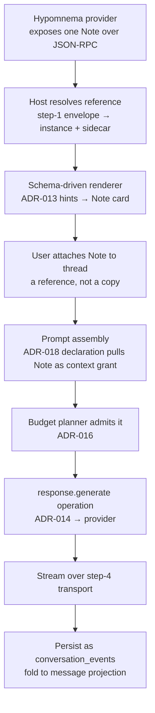

# Handoff — First Vertical Slice (step 5)

> **Tracked in Linear:** [BDS-44 — Vertical slice: end-to-end against an external Note](https://linear.app/beausimensen/issue/BDS-44) · epic [BDS-35 — external-provider boundary](https://linear.app/beausimensen/issue/BDS-35).

Build the thinnest end-to-end path that exercises the resolved architecture, to surface the
gaps only code reveals. The design has gotten deep enough that further paper work has
diminishing returns against the feedback one real slice produces.

## The slice, in one line

One real Hypomnema Note → resolved by URI → rendered via schema hints → attached to a
thread → serialized into a prompt through the budget planner → streamed back.

## The path

## Inputs to load

- ADR-003 (Vault/Note/Tag primitives), ADR-013 + `design-notes/note-walkthrough.md`
  (envelope, hints, serialization).
- ADR-016 (budget planner), ADR-018 (prompt declaration + cache breakpoints),
  ADR-014 (the `response.generate` operation).
- `design-notes/event-sourced-conversations.md` (the canonical event log + projections).
- **Step-1 output** (reference envelope) and **step-4 output** (transport decision) —
  both are hard prerequisites for a clean slice.
- ADR-007 (core stack), ADR-010 (provider boundary), ADR-011 (topology).

## Deliberate exclusions (keep it thin)

- **No transclusion.** References render as pills / reference-only. This is exactly where
  the deferred-transclusion seam gets tested — see the guardrail below.
- No suggestion engine, no multi-user, no GitHub/Linear providers, no branching.
- Read path only for context; at most one `core.document` create if a write path is needed
  to close the loop. No artifact write-back to the vault.

## Transclusion guardrail (the load-bearing constraint)

Because transclusion is deferred, the slice is where its seam either stays open or gets
welded shut. Two non-negotiables:

1. **Serialization must treat expansion as a pluggable policy defaulting to reference-only**
   — never hardcode "references are pills, full stop." The policy slot comes from the
   step-1 envelope (`pill | summary | full`); the slice implements only `pill` but routes
   through the slot.
2. **Keep ADR-016's `transclusions` budget class as a no-op placeholder** rather than
   removing it. Admitting zero transcluded tokens today is fine; deleting the class means
   re-architecting admission when transclusion returns.

Hold these and reviving transclusion is an additive ADR. Drop them and it's a wire-format
migration.

## What the slice is designed to surface

- Where the **schema-driven renderer pinches** — log every case, feeding the ADR-012
  escape-hatch "when is it insufficient?" evidence list.
- **Context-grant vocabulary gaps** — the slice's prompt assembly exercises the step-3
  Batch B enums; mismatches feed straight back there.
- **Budget admission edge cases** under a real Note + real token counts (ADR-016).
- **Transport UX** under reconnect/resume — the explicit Iris pain point (step-4 choice).
- Whether the **step-1 reference envelope holds in code**, not just on paper.

## Definition of done

- [ ] A running slice (or, if treated as a design-session handoff, a build plan with the
      interface contract at each numbered step of the path).
- [ ] Serialization routes through the expansion-policy slot; `transclusions` budget class
      present as a no-op.
- [ ] A gaps log feeding back to ADR-012 (escape hatch), ADR-013 (renderer), ADR-016
      (budget), and step-3 Batch B (context grants).
- [ ] First entry in the escape-hatch evidence list (even if it's "renderer held, no
      escape needed yet").
