---
zettelkasten:
  id: "20260530223831904"
---
# Iris as Reference Material for the Multi-User AI Workspace Design

> Working notes from reading the Iris source as a **reference point for your own independent design** of the multi-user AI workspace. Iris is licensed software belonging to TJ Miller; the [Iris License Agreement](https://claude.ai/chat/2348fa79-8f6a-48b8-a902-6bbbcbb01058#license-context) explicitly permits studying the codebase to learn AI application architecture and patterns, and using knowledge gained from Iris to inform your own original work — which is the purpose this document serves. Nothing here is a migration plan, a translation guide, or material to be lifted into another codebase.
> 
> The analytical lens throughout is **convergence and divergence**: where Iris and your ADRs/design notes arrive at similar patterns independently, you have stronger evidence that the pattern is real; where they diverge intentionally, you have a concrete counter-design to test your reasoning against; where Iris does something your design doesn't address, you have a candidate concern to consider; where your design specifies something Iris doesn't have, you're working in genuinely new territory.
> 
> One observation up front that recalibrates `overview.md`: your overview describes Iris's pain as "client-authoritative state, weak streaming UX." The codebase as it stands is actually **server-authoritative with resumable streaming** (see §4). That changes the _evidential_ picture, not a plan-of-action picture: your ADR-001/ADR-004 commitments to server-authoritative state and resumable streams aren't an unproven direction — they're a direction another independent designer working on similar problems has converged on and shipped. Strong validation. Take that into account as you read on.

## License context

The Iris License Agreement (per the file in the source tree) is unusually clear about the analytical use this document represents. The grants relevant here:

- **"Learn — Study the Software's architecture and patterns for educational purposes."**
- **"What Is Allowed ... Using knowledge gained from Iris to inform your own original work."**

The restrictions relevant here:

- No redistribution of code, no repackaging into a starter kit/template, no SaaS or customer-facing use, no using Iris to create a competing product.
- Per-seat license: this document is for your reference only and should not be shared with developers who don't hold their own Iris license.

This document is positioned squarely inside the educational-use grant: it observes Iris's architectural choices and uses them as a reference point for thinking about your own design decisions. It does not contain code that could be transcribed, it does not propose migration paths, and it does not treat Iris's implementations as material to translate. Every "Iris does X" observation is a data point informing the question "what should _your_ design do about X?" — never a recipe.

If at any point during a future session this framing slips (mine or anyone else's), the right response is to step back to the question being analyzed and answer it on its own merits with Iris available as one reference among several. The patterns are not Iris's property; Iris's specific expressions of them are.

---

## 0. Quick orientation

**What Iris is, in one paragraph.** Iris is a self-hosted, personal-first AI chat product, licensed via GitHub Sponsorship, where the LLM has a memory model that distills frequently-used facts into a stable "truths" layer, can proactively reach out via a scheduled heartbeat, can delegate long-running work to a sub-agent daemon, and exposes thread-scoped chat with composable system prompts. It runs on Laravel 13 / PHP 8.4 with PostgreSQL + pgvector for embeddings, Redis for queues and stream replay, Reverb for WebSockets, and an Inertia/React 19 frontend.

**The stack at a glance.**

|Layer|Choice|
|---|---|
|Backend framework|Laravel 13 (PHP 8.4)|
|LLM client|[Prism PHP](https://prismphp.com/) (`prism-php/prism`) — same author ecosystem as Iris|
|Primary model|`claude-sonnet-4-5` via Anthropic; cheap-model fallbacks to `claude-haiku-4-5`|
|Embeddings|OpenAI `text-embedding-3-small` (1536-dim)|
|Database|PostgreSQL 14+ with **pgvector** (advisory locks for concurrency)|
|Queue / async|Laravel Horizon over Redis; `iris:agent` daemon for sub-agents (not Horizon)|
|Streaming wire|Laravel Reverb (Pusher-protocol WebSocket) + Redis-backed event replay|
|Frontend|Inertia.js v2 + React 19 + Tailwind v4 + shadcn (custom components, **not** assistant-ui)|
|Auth|Laravel Fortify, Socialite (Google), Telegram linking|
|Deployment|Docker Compose (Coolify-friendly), `pgvector/pgvector:pg16`, redis:alpine|
|Integrations|Google Calendar, Telegraph (Telegram), tomorrow.io (weather), ElevenLabs (TTS)|

**Where Iris's choices and your design sit relative to each other** (the punchline, expanded throughout the doc):

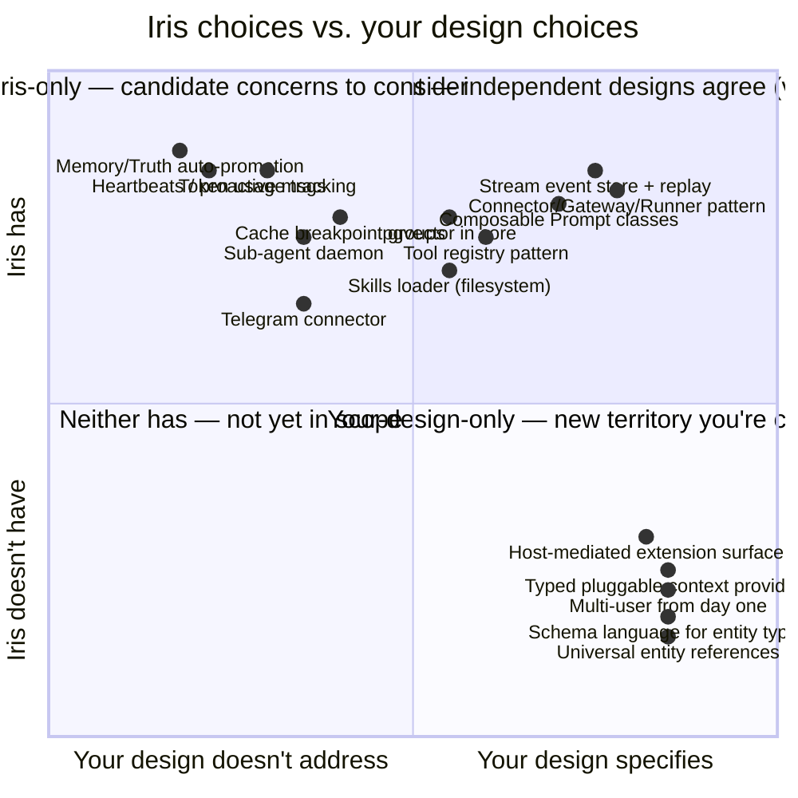

Points in the upper-right are where Iris's working implementation independently arrives at something your ADRs also specify — strong validation. Points in the upper-left are Iris-specific features your design doesn't have a position on yet; they're worth a deliberate "do we want this?" decision rather than acquiring by default. Points in the lower-right are where your design is meaningfully ahead of any reference you have — the territory worth being most thoughtful about. The §13 table makes each of these readable individually.

---

## 1. Top-level component map

The system has **three runtime processes** sharing one image and one Postgres + Redis pair:

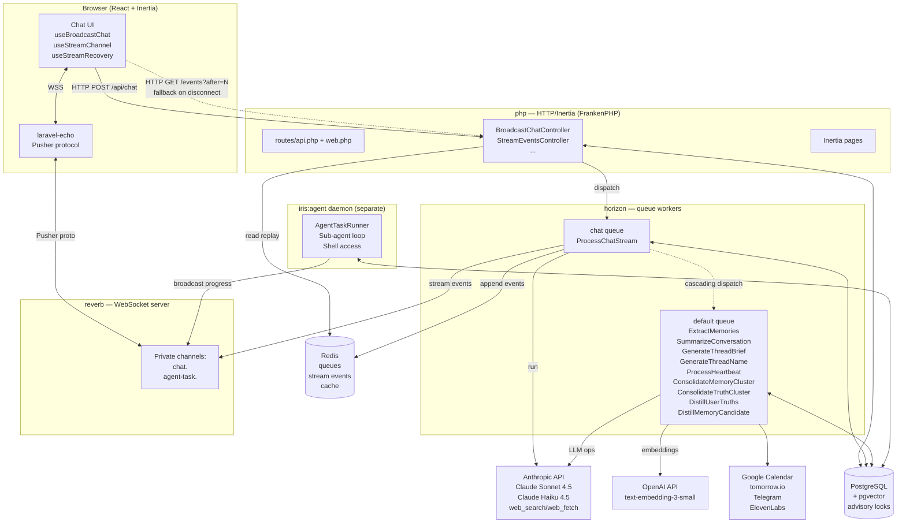

**Three things to notice immediately:**

1. **The HTTP-facing process never talks to an LLM directly.** Every LLM call is in a queued job (`ProcessChatStream`) or a daemon (`iris:agent`). The HTTP layer's job for chat is "validate input → write user message → enqueue → return 202-style JSON with a conversation ID." The browser then watches the WebSocket. This is exactly the server-authoritative pattern ADR-001 calls for.
    
2. **Redis carries two distinct concerns.** It's the Horizon queue _and_ the `StreamEventStore` (Redis sorted sets keyed by conversation ID, 600s TTL). Those are operationally independent — losing one doesn't kill the other — but they share the connection. Your ADR-004 notes "Postgres LISTEN/NOTIFY can graduate to Redis Streams later"; Iris already needs Redis for stream replay regardless, so the Postgres-only starting point you sketched is something Iris jumped past.
    
3. **The sub-agent daemon is deliberately _not_ Horizon-managed.** Sub-agent tasks run for minutes and stream tool calls in real time; that doesn't fit a queue-worker model. Worth keeping in mind when you design the equivalent — long-running streaming tasks want a different process shape than fire-and-forget jobs.
    

---

## 2. Data model

Forty-eight migrations, all under one Postgres database. Below is the core conversation graph plus the memory pipeline; calendar, weather, telegram-bot, and follow-up tables are omitted for clarity but follow the same shape (FK to `users`, indexes for queries that matter).

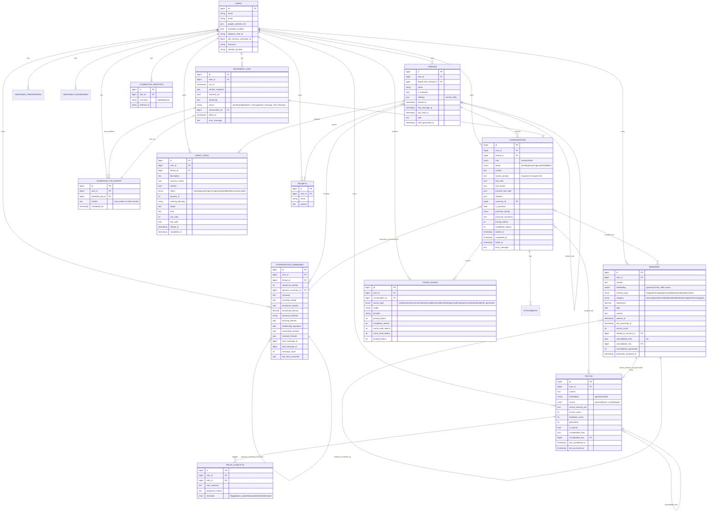

**Annotations and load-bearing facts:**

- **`conversations.system_prompt` is a snapshot, not a reference.** Every assistant turn stores the fully-rendered system prompt as it was at request time, in the row. This is how Iris keeps a faithful retry path (the §3 retry flow reuses it implicitly) and how `Insights` can show "what prompt was actually used." It does cost storage but pays off on debugging.
- **`conversations.tool_calls` / `tool_results` / `provider_tool_calls` / `citations` are all JSON arrays on the row.** The wire-protocol-level events (StreamStart, TextDelta, ToolCall, ToolResult, ProviderTool, Artifact, Citation, StreamEnd) get serialized down into structured JSON for replay and re-serialization to the model on subsequent turns.
- **Two-tier `consolidated_into` graph.** Both memories and truths have a self-FK `consolidated_into` so a chain of merges is walkable: "memory 7 was consolidated into memory 42, which was promoted to truth 12, which was consolidated into truth 19." The `consolidation_generation` counter caps the depth (default 5) so the system can't infinitely re-merge.
- **`previous_summary_id` chains summaries.** Per-thread, summaries form a linked list. `start_message_id`/`end_message_id` mark the range each summary covers. New summaries only summarize _new_ messages since the last summary's `end_message_id`.
- **`thread.settings` is a JSON blob.** Currently holds `pinned_skills` and pinned prompt IDs. Worth noting: this is the shape that _could_ hold attached-context references in the new design, if you went that way.
- **`heartbeat_logs` has `action: 'pending'` set at dispatch time** before the job runs. This is a duplicate-prevention pattern (insert-then-do-work) rather than the more common do-work-then-record. Important if you reuse the pattern.

---

## 3. The chat flow, end to end

This is the single most important sequence to internalize. The HTTP request returns within milliseconds; everything else is asynchronous.

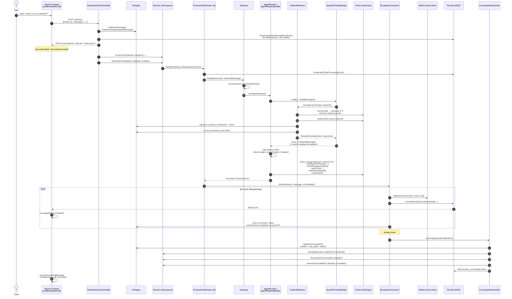

**Things that look ordinary but pay rent:**

- **Step 5: 202 returns before generation starts.** The frontend doesn't block on the LLM. This is what makes "ask a question, walk away, come back" actually work — the request can be replayed from Redis (§4) or fetched fully from Postgres after the fact.
- **Steps 12–16: the recall sub-cycle is itself an LLM op.** Before the main response runs, `ContextRetriever` makes a _separate_ LLM call (structured-output) that _generates_ the search queries that get embedded. So a single user turn fans out into ≥3 model calls: query-generation + embedding (cheap) + main response. This is the "Recall" operation in the §6 table.
- **Step 22: Every 10 events, the connector polls `conversation->fresh()`** for a `completed_at` value. This is how `POST /api/chat/stop` works — it just writes `completed_at = now()` and the loop notices on the next tick. Cancellation is cooperative, not preemptive, and there's a small delay (up to 10 events' worth of token deltas) before stream actually stops.
- **Steps 27–29: the cascade.** After every assistant turn, three jobs _may_ queue: `ExtractMemories` (only if `shouldExtract()` returns true), `SummarizeConversation` (unconditional, but the job itself decides whether to actually summarize), `GenerateThreadBrief` (only if `iris.briefs.enabled`). This is the "automatic" half of the operations pattern.

**Retry flow** is a sibling of the above. `BroadcastRetryChatController` calls `ChatHistory::getLastRetryableMessage()`, deletes everything after it, then dispatches `ProcessChatStream` with `isRetry: true`. The builder's `prepareRetryContext()` deliberately _doesn't_ create a new user conversation row; it just rebuilds history and re-runs.

---

## 4. Server-authoritative state & stream resumption

This is the area of strongest convergence with your design — Iris's working implementation does what ADR-001 + ADR-004 specify, which means those ADR commitments are validated by an independent designer arriving at the same shape.

### The three sources of truth, and what each one is for

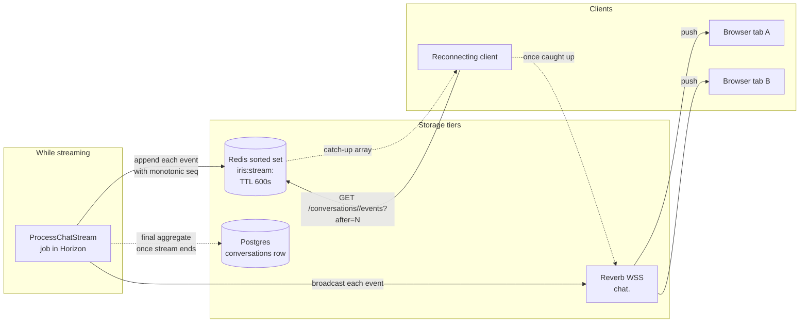

- **WSS** is the live channel — fast, push-only, ephemeral.
- **Redis** is the **replay buffer**. Each event is appended as `ZADD stream:{convId} <seq> <serialized>`. The seq is monotonic per conversation; reading with `ZRANGEBYSCORE after +inf` gives you everything since you last saw. 600s TTL is enough for "I closed my laptop, opened it 5 minutes later." Beyond that, you fall back to the Postgres row, which has the final aggregated state.
- **Postgres** is the _final_ state — content, tool calls, tool results, token counts — written once at the end. Mid-stream the row exists but is sparse (just `id`, `user_id`, `thread_id`, `role`, `started_at`).

### The two timestamps that drive state

`conversations` doesn't really use the `status` enum anymore — it uses three timestamps as the canonical state machine:

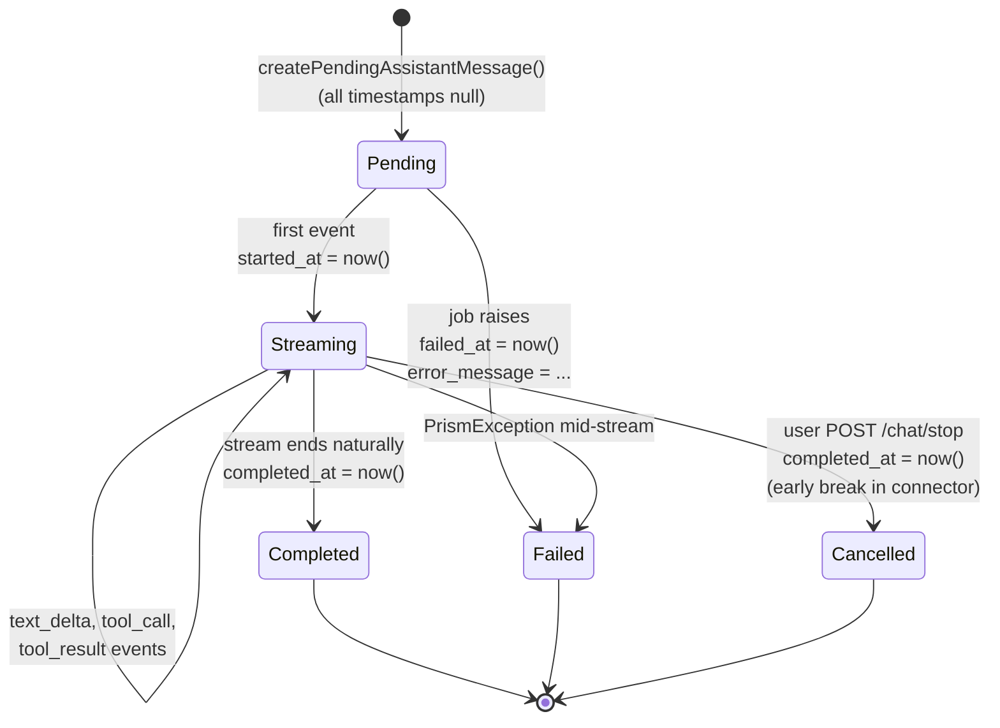

The model exposes `isStreaming()` / `isPending()` / `isCompleted()` etc. that read the timestamps first and fall back to the legacy enum only if all three are null (backward compat for old rows pre-2026-02-15 migration).

### How the client reconnects

`useStreamRecovery.ts` polls `/api/conversations/{id}/events?after={lastSeq}` every 1s for up to 300 attempts. The endpoint returns `{streaming, events, lastSequence}`. If the conversation is no longer streaming and Redis has no events, the client falls back to fetching the completed row over the regular conversation API. This poll-then-WSS pattern is also how the client recovers from the WSS itself disconnecting mid-stream — re-subscribe, but also pull missed events out of Redis to fill the gap.

**Trade-offs Iris is making here, worth noting for your design:**

- _Redis is required._ Not optional. Your ADR-004 sketch ("Postgres LISTEN/NOTIFY first, Redis Streams later") effectively gets compressed — Iris already needs Redis for both Horizon and event replay, so the simpler-without-Redis path doesn't exist.
- _Replay is by sequence number, not by content hash or causal vector._ Single-author streams only; multi-author would break.
- _The TTL is fixed at 600s._ Long pauses mid-stream that exceed 10 minutes lose mid-stream replay (the final row is still there, so you can fetch the completed result; you just can't replay the streaming animation). For your purposes this is probably fine.
- _Tool-call events are "minimal-broadcast" wrappers._ Look at `MinimalToolCallBroadcast` — it strips the full args/results from the wire format and the client has to fetch full content separately via `GET /conversations/{id}/tools/{toolId}`. This keeps WSS frames small for long tool outputs but adds a round-trip when the user expands a tool call. Same pattern for artifacts and citations.

---

## 5. The Connector / Gateway / AgentRunner abstraction

This is where Iris's architecture maps almost one-to-one onto ADR-010's "host-mediated extension surface" idea. The names differ (`Connector` vs. "transport," `Gateway` vs. "host," `AgentRunner` vs. "pipeline"), but the shape is the same.

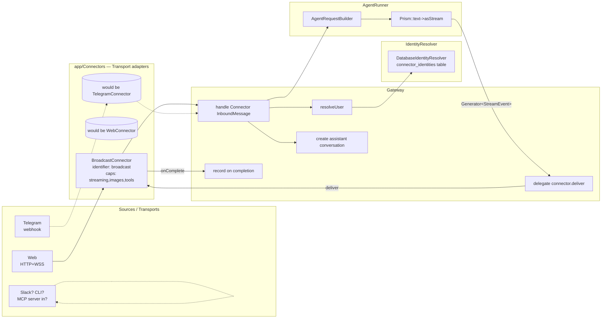

### What each piece owns, exactly

- **`Connector` interface** (`app/Connectors/Contracts/Connector.php`):
    - `identifier(): string` — the connector's name, used in `users.connector_identities.connector` lookups.
    - `capabilities(): array<string,bool>` — declares `streaming`, `images`, `tools`, `provider_tools`. A `TelegramConnector` would set these all to `false` because Telegram pushes one final message.
    - `deliver(Generator $stream, InboundMessage $message, Closure $onComplete): mixed` — consumes the stream however it wants, calls `onComplete` with the collected events so the gateway can record. Returns whatever the transport needs (a `StreamedResponse`, `null`, etc.).
    - `supportsStreaming(): bool` — auxiliary check.
- **`InboundMessage` value object** — uniform input shape regardless of transport: `connector`, `externalId`, `content`, `images[]`, `isRetry`, `threadId`, `conversationId`, `userConversationId`. Plus a `withConversationId(...)` immutable update method.
- **`IdentityResolver`** — for non-web/broadcast connectors, looks up which Iris user a given `(connector, externalId)` pair belongs to. The web/broadcast case shortcircuits because the external ID _is_ the user ID (Laravel auth already happened).
- **`Gateway`** — does identity resolution, calls `AgentRunner::run()` to get a Generator, hands it to the connector's `deliver`, records on completion. Knows nothing about HTTP, WebSocket, or anything transport-specific.
- **`AgentRunner`** — three methods (`run`, `getUserConversation`, `getEstimatedInputTokens`). Wraps `AgentRequestBuilder` and yields from `Prism::asStream()`.
- **`AgentRequestBuilder`** — the heaviest object in the chain. Builds the system prompt (§7), pulls history within budget (§8), runs sync-summarization safety net if needed, stores attachments, attaches recalled-context pivot rows on the conversation, calls Prism with all the right tools and config.

**Why this matters for your design.** This is _already_ what ADR-010 asks for — primitives the host owns, transports declaring their capabilities, identity resolution decoupled from message delivery. The two pieces missing relative to ADR-010 are:

1. **Extensions don't run as separate processes.** Today in Iris, "extension-shaped" things (Calendar, Weather, Telegram, the various Tools) all live in the same PHP image. There's no subprocess + JSON-RPC. The contract is in code, not on a wire.
2. **The primitives are baked.** `Connector` is the only extension point. There's no equivalent of "extensions can declare new entity types" or "extensions can register suggestion proposals." Iris's typed context entities (Memory, Truth, ConversationSummary) are hard-coded.

What this tells your design: ADR-010's separation between the host-mediated primitive (which Iris demonstrates is workable as an interface) and the out-of-process extension implementation (which Iris stops short of) is exactly the right axis to be working on. The interface shape is validated; the wire and process-isolation work is the genuinely new territory your design adds on top.

---

## 6. The "14 operations" pattern, made literal

`overview.md` glosses this as "Iris's pattern of orchestrating distinct model calls for distinct sub-tasks." In the code, the named operations are _literally_ the `TokenUsageSource` enum, and they're more than 14 when you count the sub-phases:

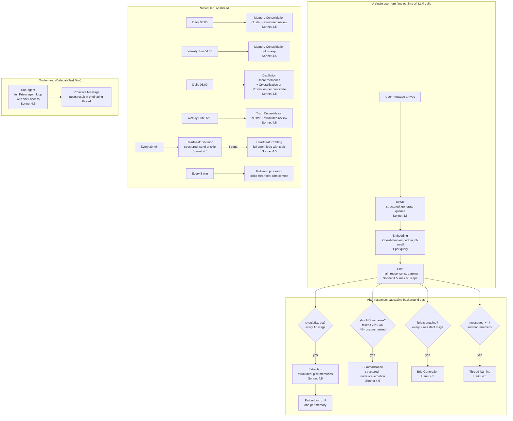

### The named operations, with what they do and what they cost

|`TokenUsageSource`|Where it fires|Model (default)|What it does|
|---|---|---|---|
|`chat`|Every user turn|Sonnet 4.5|Primary streaming response (the only streamed op)|
|`recall`|Every user turn|Sonnet 4.5 (structured)|Generates 2–4 semantic-search queries from recent thread context|
|`embedding`|Recall + Extraction + Consolidation + memory/truth writes|OpenAI 3-small|Vector generation|
|`extraction`|After every 10 user msgs|Sonnet 4.5 (structured)|Picks ≤6 memories worth storing from the last 50 msgs|
|`summarization`|After response, if 40+ unsummarized OR last response used ≥75% of context|Sonnet 4.5 (structured)|Narrative summary + emotional markers + resolved/unresolved threads|
|`brief_generation`|After every 2 assistant msgs in a thread|**Haiku 4.5**|3–6 sentence thread digest; feeds cross-thread context + heartbeat|
|`consolidation`|Daily/weekly scheduled, plus crystallization-time|Sonnet 4.5 (structured)|Merges semantically similar memories or truths into denser ones|
|`crystallization`|Truth distillation, when new evidence accesses a promoted truth|Sonnet 4.5 (structured)|Refines a truth's content with new evidence; flags conflicts|
|`promotion`|Daily distillation pass, on memory candidates|Sonnet 4.5 (structured)|Decides whether a frequently-accessed memory should become a Truth|
|`heartbeat`|Every 30 min via scheduler|Sonnet 4.5 (structured for decision, agent loop for craft)|Two-phase: decide whether to reach out, then if yes, craft and send|
|Thread naming|After 4 messages, untitled threads|**Haiku 4.5**|Picks a name; validates output isn't a refusal or essay|

That's **eleven named LLM operations** in `TokenUsageSource`. With sub-phases (heartbeat decision vs. craft; consolidation cluster identification vs. cluster review; sub-agent runs as its own loop), you hit the "14 operations" figure quoted in your glossary. The number isn't sacred — it's the _pattern_ that matters: one user interaction triggers a fan-out of named, individually-modeled, individually-tracked operations.

### How operations are implemented (the pattern in code)

Every operation follows the same skeleton:

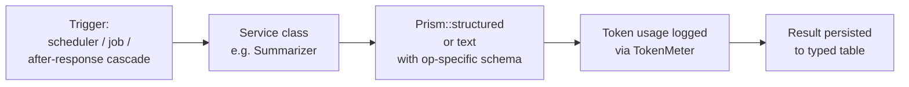

Concretely:

- A queued job (`SummarizeConversation`, `ExtractMemories`, ...) calls a service (`Summarizer`, `MemoryExtractor`, ...).
- The service builds context, defines a structured schema (`ObjectSchema`/`ArraySchema`/`StringSchema`), calls `Prism::structured()` or `Prism::text()`.
- `TokenMeter::record{Recall|Extraction|Summarization|...}` writes a row to `token_usages`.
- The result is persisted to the operation's own table (`memories`, `conversation_summaries`, `truths`, ...).
- All operations have rate-limit-aware retry middleware (`PrismRateLimitedException` → release back to queue with `resetsAt`-based delay).

**Where this lives in `open-questions.md`:** "Where does the '14 operations' pattern live? Probably start with a typed dictionary keyed by operation name with model + prompt-template values."

Iris's answer in code is **closer to a registry than a dictionary**, but it's spread across:

- `config/iris.php` (model + provider + timeout per op, e.g. `iris.summarization.provider`, `iris.briefs.model`)
- A dedicated **service class per operation** (`Summarizer`, `MemoryExtractor`, `TruthCrystallizer`, ...)
- A dedicated **queued job per operation** (`SummarizeConversation`, `ExtractMemories`, ...) that's a thin shim over the service

It's _operationally_ a registry — each operation has a config key, a service, and a job — but there's no central `OperationRegistry` class. If you wanted to expose operations as pipeline-hook extension points (as ADR-010 suggests), the natural starting point would be to introduce that registry and have it dispatch by operation name, then let extensions register against the name.

---

## 7. The Memory / Truth pipeline

This is Iris's most distinctive feature. It's also the part most likely to _not_ belong wholesale in your new project — but the _shape_ of it (mechanically-promoted, multi-layered, time-aware, conflict-aware) is worth understanding.

### The mental model in one diagram

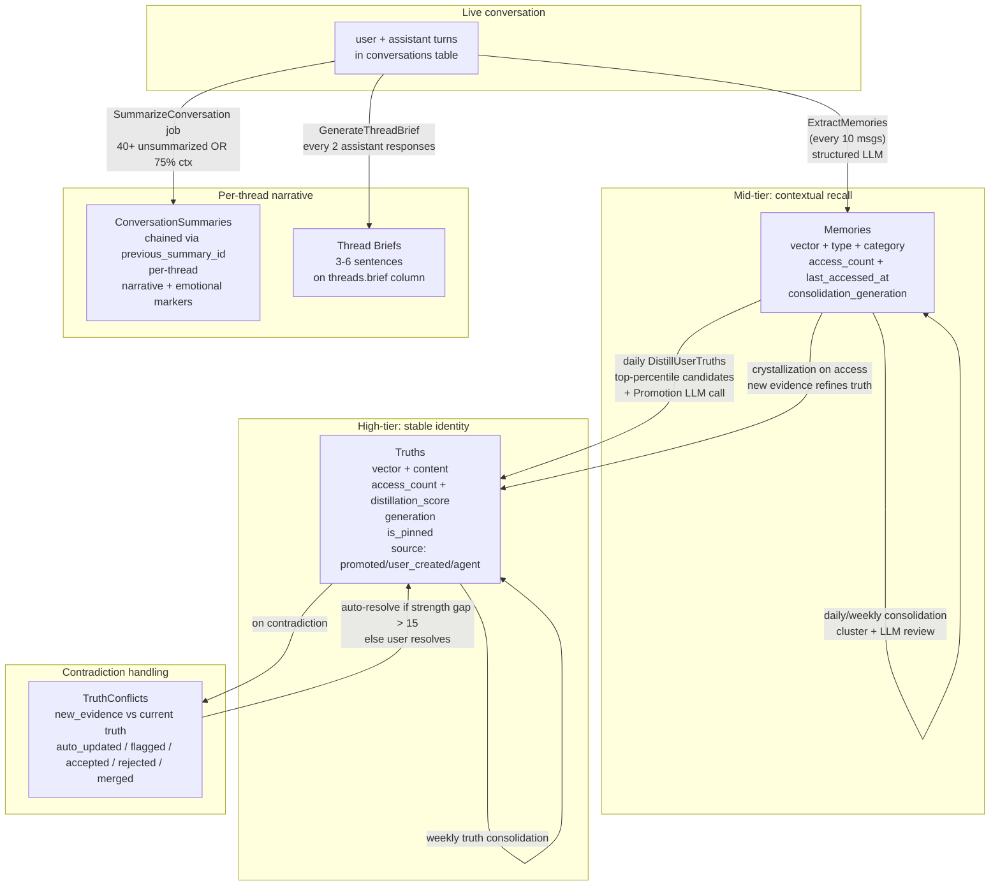

### How memory promotion actually works (the algorithm)

The flow from "user said something interesting" to "Iris always remembers this about me" runs through three stages, gated at each step:

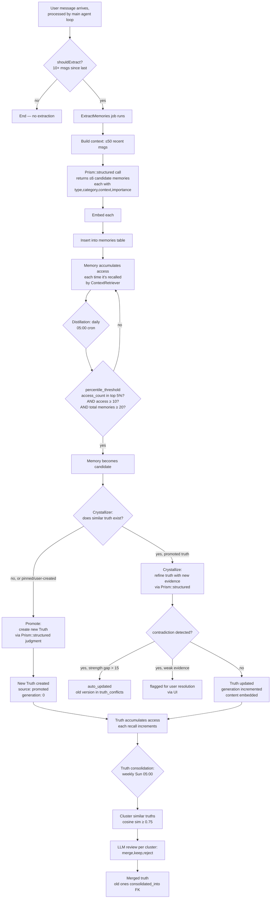

### Where the recall side comes in

When you send a message, **all of the above happens in the background**, but the _foreground_ recall sub-cycle from §3 reads both tables:

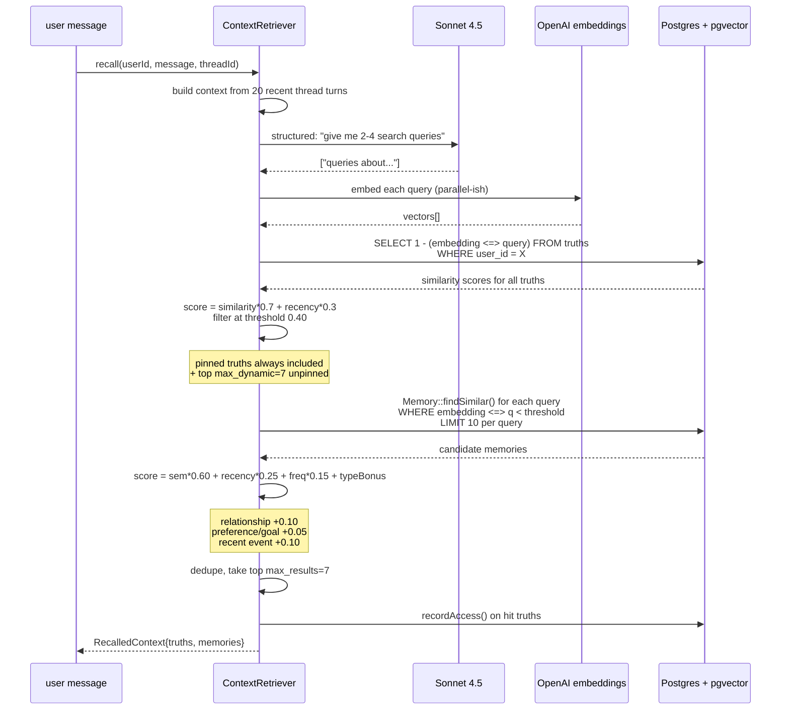

The scoring weights live in `config/iris.php` and are tunable. The thresholds (truths 0.40, memories 0.38, duplicate 0.80, conflict resolution 15-point gap) are also config.

### What Iris's memory model tells your design

Iris's memory layer maps onto your draft schema language + design notes like this:

|Iris concept|Closest concept in your design|What this tells your design|
|---|---|---|
|Memory|A typed `core.memory`-style entity in the schema language|Iris validates that a vector-shaped, typed, lifecycle-tracked memory primitive is workable. Your schema-language envelope would describe its fields; it'd likely belong to its own provider rather than be a "context provider" output.|
|Truth (`is_pinned`)|An attached entity in a Context Set, pinned by default|The "stable, cross-thread, always-in-prompt" semantics correspond cleanly to "pinned in a Context Set." Iris's behavior here doesn't require a new primitive in your design.|
|Truth (auto-promoted)|A _signal_ the suggestion engine would produce, then user/system promotes|Iris's promotion-by-LLM corresponds to the "LLM-based ranking" branch of your suggestion signal mix open question. The reference takes a different position than your sketched "start lexical + graph" — Iris uses no lexical or graph signals at all.|
|ConversationSummary chain|A type that handles per-thread state|Could remain core-owned since it's about the thread itself, not user-defined context. Iris's per-thread chain-of-summaries pattern is reference for how that type's lifecycle could look.|
|Thread brief|Same|Same.|
|TruthConflict|A friction/open-question-shaped entity that needs UX to resolve|Iris demonstrates this is a real surface that needs design attention; your project would express it as a real entity type with a resolve action.|
|`category` enum on memories|A user-defined taxonomy emerging from the type system|Iris's hard-coded `personal\|professional\|hobbies\|...` enum is exactly what your schema language generalizes away from. The reference is a negative example: opinionated taxonomies don't fit user-defined typed entities.|

**A genuine open question for your design:** Iris's Truth/Memory split is "automatic promotion based on access patterns." Your design has no equivalent of this pattern yet. The closest concepts in your notes are:

- "Conversation-as-entity" (would let a user pin a whole conversation as context),
- "Query-shaped references" (a stored search that resolves dynamically),
- The "augmentation surface for Context Sets" (where extensions hang summaries/suggestions).

Auto-promotion is genuinely orthogonal to all three. If your design wants it, it'd be expressed as an _augmentation_ (an extension that produces typed entities of an auto-promotion variety), not as a new schema slot. Worth deciding deliberately whether you want it at all — Iris demonstrates one designer chose it; that's not evidence your design should.

---

## 8. System prompt assembly — the cache-breakpoint dance

Per `config/iris.php`, the system prompt is composed from a list of Prompt classes, grouped for cache control. Anthropic enforces ≤4 `cache_control` markers per request; iris's design is one clean answer to that constraint.

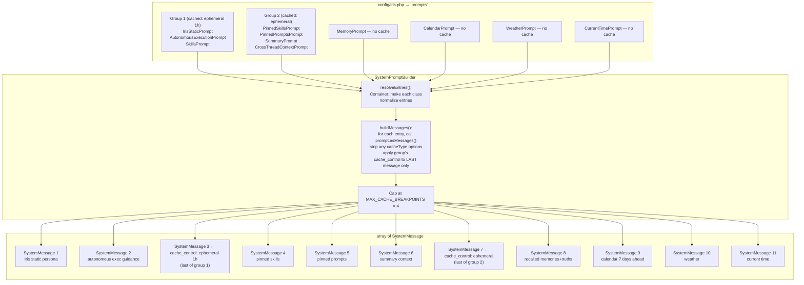

### Why this is a smart design

1. **The configuration is the schema.** Want to add a new prompt? Add a class implementing `Prompt::content()` and put it in `config/iris.php`. Want to change cache placement? Move it between groups. No code changes elsewhere.
2. **Cache placement is centralized.** Individual prompts no longer try to set their own `cacheType` — `SystemPromptBuilder` strips any they accidentally include and applies cache_control from the group config. This was a bug fix: before, more than 4 prompts trying to cache caused 400 errors. The config is now the _single authority_ for caching.
3. **The first group is the most stable.** `IrisStaticPrompt` (persona) + `AutonomousExecutionPrompt` (behavior policy) + `SkillsPrompt` (loaded SKILL.md files) — those barely change. 1h cache TTL.
4. **Per-thread stable content is in group 2.** Pinned skills, pinned prompts, summary, cross-thread context — stable within a thread but change between threads. Default ephemeral cache.
5. **Dynamic per-turn content is outside any cache group.** Memory recall, calendar, weather, current time — all different on every request. No cache breakpoint wasted on them.

### Notable Prompt classes (what each one reads)

|Prompt class|Reads from|When it changes|
|---|---|---|
|`IrisStaticPrompt`|A Blade view: `prompts.personas.iris-static`|Code change only|
|`AutonomousExecutionPrompt`|Static text about tool usage protocol|Code change only|
|`SkillsPrompt`|`SkillLoader::load()` — scans `.agents/skills/*/SKILL.md`|When a skill file is added/edited|
|`PinnedSkillsPrompt`|`Thread.settings.pinned_skills`|Per-thread; user toggles|
|`PinnedPromptsPrompt`|`prompts` table via `prompt_thread` pivot|Per-thread; user pins custom prompts|
|`SummaryPrompt`|Most recent N `ConversationSummary` rows for this thread (default 3)|When a new summary lands|
|`CrossThreadContextPrompt`|`CrossThreadContextProvider::retrieve()` → up to 5 threads' briefs|When other threads get briefs|
|`MemoryPrompt`|`ContextRetriever::recall()` — every turn|Every request|
|`CalendarPrompt`|`CalendarRetriever` (Google Calendar, stale-while-revalidate cache, 15min fresh / 60min stale)|Every request|
|`WeatherPrompt`|`WeatherRetriever` (tomorrow.io, similar SWR cache)|Every request|
|`CurrentTimePrompt`|`now()->setTimezone(user.timezone)`|Every request|

This pattern is closely aligned with the "extension declares intent, host decides surface" shape in ADR-010. Each prompt class declares **what it needs** (RequestContext, services); the host (SystemPromptBuilder) decides **where and how** to render it (which cache group, what order, whether to skip if empty). Iris demonstrates the pattern works as an in-process convention; your design takes the same shape and extends it across an extension boundary.

**What's missing relative to your design:**

- Prompts can't be added by an out-of-process extension — they're PHP classes registered in a config file.
- There's no schema describing what each prompt produces; just rendered Markdown.
- Order is determined by config-array order; there's no declarative "this prompt must come after that one."

---

## 9. Tools — the model's hands

`config/iris.tools` registers tool classes; `ToolRegistry::getTools()` resolves them through the container and hands them to Prism. Iris has 27 user-facing tools plus 2 provider tools.

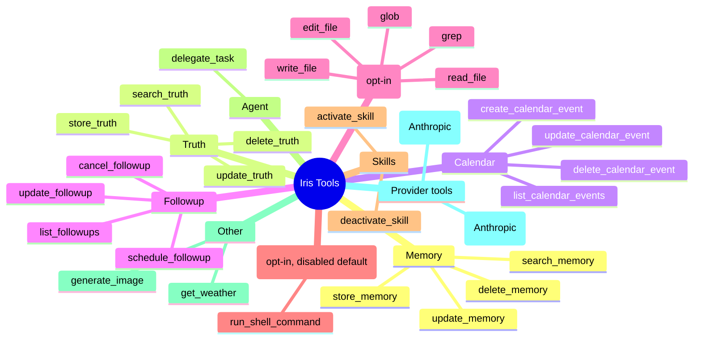

### What's load-bearing about the tool design

- **Each tool is a `Prism\Tool` subclass.** Constructor injection works — `ReadFileTool` takes `WorkspacePathResolver` and `ReadFileSessionTracker`; `DelegateTaskTool` takes `SubAgentManager` and `RequestContext`.
- **Activation is declarative.** Tools register their schemas via the builder (`$this->as('name')->for('description')->withStringParameter(...)`). Prism does the parameter validation; the tool's job is just `handle()`.
- **Three tools have feature gates.** Filesystem, shell, and sub-agent delegation are all disabled by default, gated by env (`IRIS_FILESYSTEM_ENABLED`, `IRIS_SHELL_ENABLED`, `IRIS_SUBAGENT_ENABLED`). When disabled, they're not in the registry → not in the prompt's tool list → invisible to the model.
- **Skills can activate tools mid-conversation.** `ActivateSkillTool` writes to `Thread.settings.pinned_skills`, which means the _next_ turn's system prompt will include that skill's content. So a skill is effectively a "lazy-loaded prompt fragment" the model can pull in when relevant.
- **`DelegateTaskTool` is a different shape.** It returns immediately (saying "task delegated, you'll be notified") rather than blocking on the result. The daemon eventually posts the result as a _proactive message_ in the originating thread. This sidesteps the max-steps limit that would otherwise apply to long-running tool calls.
- **Provider tools (`web_search`, `web_fetch`)** are passed as raw JSON descriptors to Prism, not as `Tool` subclasses. They execute inside Anthropic's infrastructure, with citations coming back as `CitationEvent`s.

### How this maps to ADR-010 / your "tool exposures via MCP" idea

Iris's tool registry is exactly what ADR-010 calls "tool exposures via MCP" _if_ you imagine the tools running out-of-process. They don't today — they're all PHP classes — but the **declarative shape** is essentially identical:

- Declared: name, description, parameter schema.
- Invoked: by the model, args validated by Prism.
- Returns: result (string or structured) that the LLM sees on the next step.

What this tells your design: the declarative tool shape ADR-010 envisions — name, description, JSON-schema'd parameters, invocation-then-result — is the same shape Iris uses in-process, which is the same shape MCP standardizes on the wire. Three independent contexts converging on this shape is strong evidence the abstraction is right.

**Worth noting:** tool _enablement_ in Iris is per-deployment (env flags) and per-thread (skills pinning). There's no per-user-grant or per-extension-trust-tier system. Your ADR-010 mentions trust tiers as deferred; Iris is also deferring this.

---

## 10. Heartbeats — proactive messages

Every 30 minutes, `iris:heartbeat` cron triggers `HeartbeatOrchestrator::run()`. For every user with `heartbeat_enabled: true`, it dispatches `ProcessHeartbeat`.

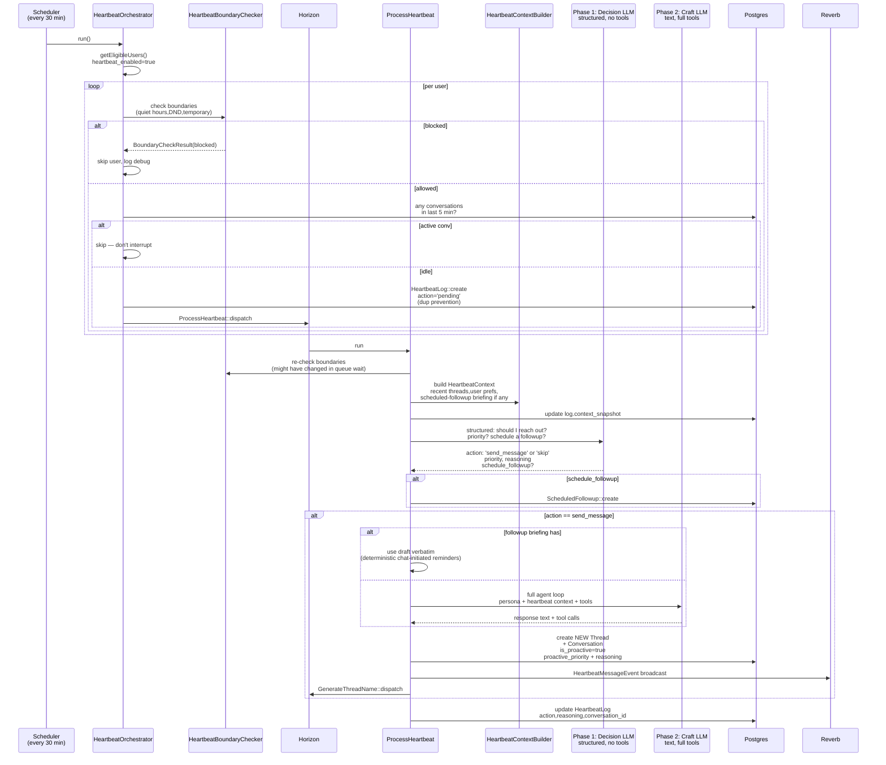

### What's surprisingly nuanced

- **Boundaries are typed.** `HeartbeatBoundary` rows can be `QuietHours`, `TemporarySilence`, or `DoNotDisturb`. Quiet hours are recurring (user sets "10pm–8am"). DND is open-ended. Temporary silence has a timestamp. Boundary checks happen **twice** — once at orchestration time (saves a queue slot) and once at job execution time (might have changed during queue wait).
- **`HeartbeatPreferences`** are user-supplied "topics I'd like Iris to think about" — feeds into the decision-phase prompt. Distinct from boundaries.
- **Proactive messages always create a new thread.** They never append to an existing one. `REQ-016` is referenced in the code as a hard requirement. This is interesting design — it sidesteps any "is this still on-topic?" question by definition.
- **Scheduled followups can be self-contained.** A normal heartbeat decides "I want to follow up with X in 2h"; that schedules a `ScheduledFollowup` row with the entire briefing in `context`. When the followup time arrives, a separate scheduler kicks `ProcessHeartbeat` again, but this time with the followup as input. If the briefing contains a `## Draft` section, the message is sent **verbatim** without re-running the craft LLM — making "ping me in 2h about my dentist appointment" deterministic.
- **Two-phase LLM = cost optimization.** Decision is structured-output (no tools, ~4K max tokens) — cheap. Craft is full agent loop (~16K max) — expensive. Only ~5% of decisions reach the craft phase in practice, so the average heartbeat cost is dominated by the decision call.

### What this tells your design

Heartbeats are an Iris feature, not architecture your design needs to mirror. You don't need them in v0 of your project. But the _pattern_ — a scheduled background pipeline that uses the same prompt + tool stack as foreground chat — is one worth noting. If your design implements the connector/gateway pattern properly, "proactive message" becomes "the gateway is triggered by a scheduler instead of an HTTP request." That generalization is a useful test for your gateway's shape: if you can't imagine triggering it from a scheduler, the abstraction is probably wrong.

That said: a few interactions with your design surface:

- The "conversation-as-entity" open question gets sharper here. Iris already has conversations that _exist independent of any user action_. A proactive thread starts from nothing. If conversations become referenceable entities in your design, you need an answer for "how does the agent reach back to a proactive thread."
- Boundaries are an obvious place where typed entities (a `boundary` type owned by some provider) would slot into your schema-language design.
- The `## Draft` mechanism is a small example of the "stored search vs. stored answer" question — a _resolved-at-creation_ artifact embedded in a _resolved-at-fire_ context. Worth considering when your design exercises query-shaped references against resolved-snapshot references.

---

## 11. Sub-agents & the agent daemon

`DelegateTaskTool` opens a parallel execution stream. The main conversation continues; meanwhile a separate process picks up the delegated task and runs it to completion.

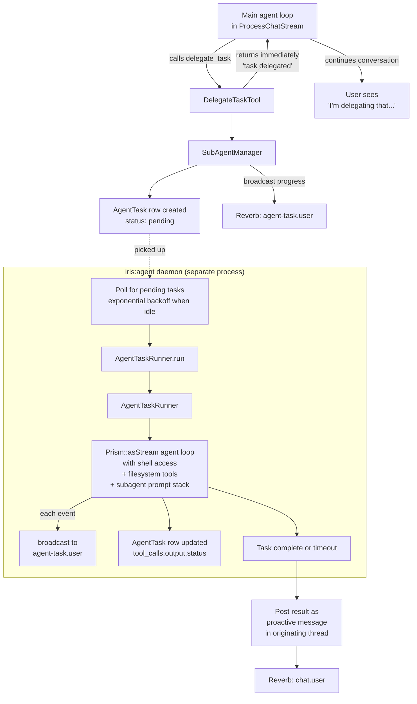

### What's distinctive

- **Sequential, single-worker.** The daemon processes one task at a time. There's no thread of execution per task; the daemon is the worker. The justification is in `docs/architecture/background-jobs.md`: "Sub-agent tasks can run for several minutes and involve streaming LLM responses with real-time tool call broadcasting. This doesn't fit well into a traditional queue worker model."
- **Inline rate-limit handling.** Unlike queued jobs (which release back to queue on rate limit), the daemon sleeps in place and retries. This makes sense because the task already has resources allocated (process, shell access) — releasing and re-acquiring is wasteful.
- **Result delivery is a proactive message.** Same code path as heartbeats — `is_proactive: true`, broadcast as `HeartbeatMessageEvent`, lands in the originating thread (here, not in a new one, unlike heartbeats).
- **Capability surface is high.** Sub-agents get shell, filesystem read/write, and the full standard tool set. Disabled by default.
- **Skills work inside sub-agents.** The sub-agent system prompt includes the same `SkillsPrompt` as the main agent, so any active skills (e.g. agent-browser) work in the delegated task. `.agents/skills/` includes an `agent-browser` skill with shell-script templates — that's exactly this case.

### What this tells your design

Sub-agents are the closest existing thing in Iris to your project's "operations as pipeline-hook extension points." They are:

- **Long-running** (minutes, not seconds),
- **Out-of-band** (don't block the main conversation),
- **Stateful** (have their own working directory, their own conversation context, their own tool surface),
- **Cancellable** (the daemon polls `AgentTask::status` for `cancelled`).

If your design eventually grows agents as a first-class concept, the data-model shape Iris arrived at (`agent_tasks` table + a daemon distinct from the queue worker) is one reference point for the operational shape such a thing might take. The thing missing in Iris — and something your design would need to think about deliberately — is multi-tenancy and trust isolation: in Iris, sub-agents and the host run in the same process tree with the same filesystem and env access. A multi-user system can't accept that.

---

## 12. Frontend — server-as-source, client-as-view

The frontend deliberately holds _minimal_ state. The shape is exactly what ADR-002 + `assistant-ui` describe, just built from scratch on shadcn instead of using assistant-ui.

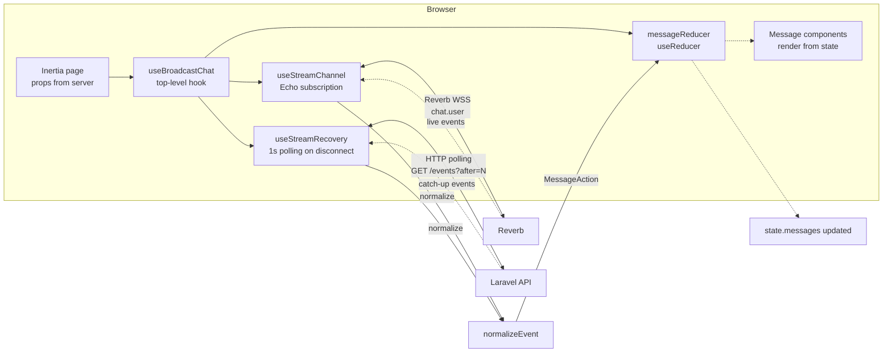

### Reading the reducer

`message-reducer.ts` is ~330 lines and handles ~20 action types: `addUserMessage`, `addPendingAssistantMessage`, `appendTextDelta`, `addToolCall`, `updateToolCallStatus`, `addToolResult`, `addCitation`, `addArtifact`, `finalizeMessage`, `markFailed`, etc. The state is a normalized array of `ChatMessage` with derived statuses.

### What this tells your design

This is the cleanest evidence that the _frontend pain_ `overview.md` mentions ("frontend customizations putting them in conflict with upstream updates") isn't about state shape — Iris's state shape is fine. The pain is more likely about **iterating** on UI when the relevant React components are baked into the same repo as the backend, and there's no plugin layer for adding new views.

ADR-012's "schema-driven entity rendering" is what would unblock that. In Iris, `MessageBubble`, `ToolCallDisplay`, `ImageDisplay`, etc. are all hand-written per type. If Iris's typed entities had a presentation-hints sidecar (which ADR-013 specifies), a generic renderer could draw most of them — which is exactly the gap your design fills.

That said, **the streaming + reconciliation logic Iris built is non-trivial work that you'll need an equivalent of**. `useStreamChannel` + `useStreamRecovery` + `messageReducer` together are about 1,500 lines that solve hard problems (disconnection, reconnection, out-of-order events, race between WSS push and HTTP catch-up). Your design will need its own answers to all of these. Looking at Iris's solutions as one reference is useful; the design decisions involved (poll cadence on disconnect, when to fall back from replay to fetching the completed row, how to reconcile pending vs. replayed events) are the same decisions you'll face independently.

---

## 13. Where Iris and your design converge or diverge

This table is the readout of the §0 quadrant chart. The column "**Relationship**" captures where Iris's choice sits relative to your design's commitment on the same question. "**What this tells your design**" is the analytical takeaway — the implication for your design's confidence on that decision, never an instruction about Iris's code.

|Architectural question|Iris's choice|Your ADR / design position|Relationship|What this tells your design|
|---|---|---|---|---|
|Where does message state live?|Server-authoritative; `started_at`/`completed_at` timestamps on `conversations`|ADR-001 specifies server-authoritative|**Convergent**|ADR-001 validated by independent implementation. Your direction is sound; the open work is fitting it to your event-log model.|
|How do clients recover from disconnect?|Redis sorted-set replay (TTL 600s) + HTTP poll endpoint + WSS resubscribe|ADR-001's "reconnect by cursor" + ADR-004 resumability|**Convergent**|Strong validation of the pattern. The specific TTL window and Redis-as-replay-buffer are design choices Iris made that your design will face independently.|
|Is the event log the canonical state, or a transport detail?|Transport detail in Iris — wire events in Redis are TTL'd; only aggregates persist to Postgres|ADR-004: "the event log is the wire protocol" — canonical state|**Divergent**|Your ADR-004 is more ambitious than Iris's implementation. Your design has a stronger commitment to event sourcing than the reference does — that's intentional new territory.|
|How does the frontend hold streaming state?|Hand-built useReducer + Echo + recovery hooks; **not** assistant-ui|ADR-002 specifies `ExternalStoreRuntime` from assistant-ui|**Adjacent**|Iris validates that hand-built works fine. Your ADR-009 commits to assistant-ui anyway — a separate decision, not contradicted by Iris's choice.|
|How are transports/connectors decoupled from the agent?|`Connector` interface; `Gateway` orchestrates; `IdentityResolver` separate|ADR-003 + ADR-010 host-mediated extension surface|**Convergent (shape) / Divergent (mechanism)**|Interface shape validated. Mechanism differs: Iris's connectors are in-process classes; ADR-010 specifies subprocess + JSON-RPC. That's your design's genuine addition.|
|How are system prompts composed?|`Prompt` class per concern, registered in config array, with cache-group annotations|ADR-010 pipeline-hook subcategory|**Convergent (pattern) / Divergent (extensibility)**|The "config registers prompt-producing classes, host orchestrates rendering" pattern is validated. Iris doesn't extend it across an extension boundary; your design would.|
|How are tools registered for model use?|Prism `Tool` subclasses listed in config; declarative schema|ADR-010 tool exposures via MCP|**Convergent (declarative shape)**|The declarative-tool shape converges with MCP independently. Three contexts (Iris in-process, MCP on wire, your design's combination) arrive at the same abstraction. Strong validation.|
|How are LLM operations beyond chat tracked and modeled?|`TokenUsageSource` enum + per-op service classes + per-op queued jobs; no central registry|`open-questions.md`: "Where does the '14 operations' pattern live?" — undecided|**Iris-only / pattern available**|Iris demonstrates a workable ad-hoc convention (config-key + service + job per operation). Your open question stays open; Iris is one data point on what a less-formal version of the pattern looks like in practice.|
|How is Anthropic's 4-cache-breakpoint limit handled?|Config groups prompts; group's cache-control applied to last non-empty message in group; `SystemPromptBuilder` is single authority|Not addressed in your ADRs|**Iris-only / forced constraint**|This constraint hits your design regardless of architecture. The "single authority for cache placement" principle is the design lesson; the exact mechanism is yours to design.|
|How are persistent facts about a user stored?|`Memory` (vector, typed, accessed-counted) + `Truth` (auto-promoted from memories) + `ConversationSummary` (chained, per-thread narrative) + thread `brief`|Not specified directly; your design has typed context entities (ADR-003 / ADR-013) but no specific memory-distillation primitive|**Iris-only / candidate concern**|Iris's auto-promotion (Memory→Truth, with crystallization on new evidence and consolidation on similarity) is sophisticated and Iris-specific. Your design has no equivalent. Worth a deliberate decision: do you want auto-promotion? If yes, it fits ADR-013 as an extension that augments a memory type, not as a core feature. If no, the simpler "user-managed long-term context" approach is fine.|
|What is the schema language for entity types?|Implicit — schema is migrations + PHP property docblocks; no separate declaration layer|ADR-013 specifies JSON Schema + presentation hints + routing envelope|**Your-design-only**|This is your design's clearest lead over Iris's reference. Iris's hard-coded shape is exactly what ADR-013 generalizes away from. Your design's typed-envelope approach is genuinely new territory relative to the reference.|
|How do entities reference each other across providers?|No cross-provider references; everything is one app|ADR-013's universal triple `{provider, type, id, label?}`|**Your-design-only**|Your design is doing something Iris doesn't attempt. The reference offers no validation either way — just confirms the question is new territory.|
|Is the system multi-tenant from day one?|Schema is `user_id`-scoped throughout; single-user deployment in practice|ADR-005 commits to multi-tenancy from day one|**Convergent (schema) / Divergent (use case)**|Iris validates that the row-level scoping pays off without near-term cost. ADR-005 is on safe ground.|
|How is conversation history compacted into the context window?|Two-tier tool-output pruning + async summarization with sync safety net + token budget calculator|Not addressed directly in ADRs|**Iris-only / inheritable concern**|Every long-running chat product faces this. Iris's specific approach (protected recent turns + older-turn previews + summary chain) is one design point among several. Your design will need to address this; Iris's choices are reference material for that decision.|
|How are long-running agent tasks separated from chat?|Dedicated `iris:agent` daemon, not Horizon; results post as proactive messages|Not addressed in ADRs|**Iris-only / candidate concern**|Long-running streaming tasks don't fit queue-worker model. If your design eventually grows agents, this constraint is real.|
|How are out-of-band/proactive messages handled?|Heartbeat scheduler + boundary system + dedicated thread per proactive message|Not addressed; conversation-as-entity is an open question|**Iris-only / feature, not architecture**|Don't acquire heartbeats by default. The pattern (scheduled trigger → gateway → message) is a useful test of your gateway abstraction's generality.|
|Where does the embedding pipeline live?|pgvector in the core Postgres, OpenAI for vectorization|`open-questions.md`: "Embedding pipeline location" — pgvector vs. extension|**Iris-only / informs your open question**|Iris demonstrates pgvector-in-core works for the operations described. Your open question's "simple cases work in core, escalate later" answer gets one data point of support.|
|How are skills (SKILL.md content) integrated?|`SkillLoader` scans filesystem; `Thread.settings.pinned_skills` controls which surface; `SkillsPrompt` injects active ones|`open-questions.md`: "Should skills be first-class or content?" — undecided|**Iris-only / informs your open question**|Iris treats skills as content that the SkillsPrompt happens to ship. Works fine in practice. Your open question gets a "content works" answer from the reference.|
|How is real-time streaming delivered?|Laravel Reverb (Pusher protocol over WSS) + minimal-event broadcasts|`open-questions.md`: "Streaming approach in the Symfony core" — Mercure / FrankenPHP / external|**Adjacent (Laravel-specific)**|Iris is Laravel-native; your design is Symfony-bound (ADR-007). The frontend pattern (private channel per user, minimal-event broadcasts, separate fetch for tool details) is transferable as a _design_ across both stacks.|
|Auth model|Fortify + Socialite (Google) + Telegram linking|`open-questions.md`: undecided OIDC vs. password|**Iris-only / informs your open question**|Iris uses framework-native (Fortify), which is the analogue of Symfony Security's bundled flows. The reference doesn't strongly answer your open question; the choice depends on your tolerance for swapping later.|

### What Iris tells you about your open questions

Going through `open-questions.md` with the reference in mind:

- **"Iris: migrate, replace, or coexist?"** — Migrate isn't a real option (license-restricted; not your codebase). Replace and coexist are both live. Iris's strong shape-level convergence with your ADRs (server-authoritative streaming, connector pattern, prompt-class pattern) means your design isn't fighting Iris's choices on most architectural questions — which makes coexist (Iris as an upstream-of-yours context provider you happen to also run) particularly viable: the two systems can talk to each other without their abstractions clashing. Replace is also workable; your design's lead on schema language and extensibility makes a clean Symfony build credible.
- **"Where does the '14 operations' pattern live?"** — Iris's answer is "spread across config keys + service classes + queued jobs, no central registry." It works at one-developer scale. For an extension-friendly design, a real `OperationRegistry` (or whatever you call it) is probably necessary; Iris's approach is the version-zero you don't have to replicate.
- **"Streaming approach in the Symfony core"** — Iris uses Reverb. The closest Symfony-native equivalent is Mercure, which has comparable frontend ergonomics (it's also Pusher-protocol-adjacent at the JS layer). FrankenPHP native streaming is another option ADR-007 names. Iris demonstrates the _frontend_ pattern is portable across transports.
- **"Embedding pipeline location"** — Iris uses pgvector in core. The "simple cases work fine in pgvector inside the core" branch of your open question gets one independent vote of support. The Python-extension branch remains untested by Iris because Iris never needed it.
- **"Suggestion engine signal mix"** — Iris uses _embeddings + recency + frequency + type bonus_, no lexical, no graph walks, no LLM-as-reranker (the LLM generates queries, doesn't rerank). Your open question's sketched mix ("start lexical + graph") would be a divergence from this reference. Worth knowing the reference takes a different position.
- **"Attached entity serialization into the prompt"** — Iris uses option (a) from your open question: direct injection. Recalled memories + truths become a system prompt block. No tool-call retrieval; no size threshold. Works for Iris because its entities are tiny (single-paragraph). Your design's larger entity sizes (a whole Note body, a Linear issue, etc.) make option (c) — the hybrid — more relevant. Iris's reference doesn't translate cleanly here.
- **"What is the search request/result shape?"** — Iris doesn't have a generalized search-as-capability. Each call site has its own bespoke surface (`Memory::findSimilar`, `Truth::query()->forUser()`, calendar fetches). Your `design-notes/search-shape-notes.md` is doing genuinely new work; the reference offers no validation, just confirms the question is open.
- **"What is the schema language for entity types?"** — Iris doesn't have one. Your design (ADR-013) is meaningfully ahead.
- **"Picker shape: hierarchical or flat?"** — Iris doesn't have a `@`-picker because it doesn't have user-pickable typed entities. The closest thing (pinned-skills toggles in a modal) isn't a picker design. The reference is silent.

---

## 14. Recommended deep-dive sessions

These are the chunks of Iris worth a focused reading session of their own, each pointed at one of your design decisions. The framing is: read Iris's choices as one reference point while you work through what _your_ design should do on the same question. The prompts below assume that framing — they're about your design's decisions, with Iris available as a reference.

### Session 1 — Convergence on the connector/gateway/runner pattern (ADR-010 implications)

> Your design's ADR-010 host-mediated extension surface specifies that connectors, providers, and tool servers all communicate with the host through declared primitives. Iris is a reference point: it has a `Connector` interface, a `Gateway` that orchestrates identity → request build → stream → deliver, and an `AgentRunner` that produces a stream — all in-process. Work through the design questions that face your ADR-010 implementation, using Iris's choices as one input: where does identity resolution sit when an MCP-style server claims to "be" a transport? What's the minimal capability negotiation a connector needs to declare? Where does the boundary between gateway responsibility and connector responsibility fall when extensions are out-of-process? Produce the design — not a comparison — your design's connector primitive should look like, informed by what Iris validates and what your design adds (subprocess isolation, JSON-RPC wire, capability negotiation).

Iris files to read as reference:

- `app/Connectors/Contracts/Connector.php`
- `app/Connectors/Contracts/IdentityResolver.php`
- `app/Connectors/Broadcast/BroadcastConnector.php`
- `app/Connectors/Gateway.php`
- `app/Connectors/ValueObjects/InboundMessage.php`
- `app/Agent/AgentRunner.php` + `AgentRequestBuilder.php` + `AgentRequest.php`
- `app/Jobs/ProcessChatStream.php` (how a job calls the gateway)
- `app/Http/Controllers/Api/BroadcastChatController.php` (how HTTP calls the job)

### Session 2 — The event-log question (ADR-004)

> ADR-004 specifies the event log as the canonical state. Iris is a reference point: it puts wire events in Redis (TTL'd, replay-only) and final aggregates in Postgres — a more conservative position than ADR-004's. Work through your design's choices: what does it mean for the event log to be canonical? What's the data model for an event-sourced conversation? What does cleanup / archival look like? Is a Redis-shaped replay buffer still needed, or only for the live-broadcast leg? Iris's split (Redis for live replay, Postgres for aggregates) is one reference; full event sourcing (everything in Postgres, fold to compute state) is another; figure out which your design wants.

Iris files to read as reference:

- `app/Services/StreamEventStore.php`
- `app/Connectors/Broadcast/BroadcastConnector.php` (where events get appended/broadcast)
- `app/Http/Controllers/Api/StreamEventsController.php` (the replay endpoint)
- `resources/js/hooks/chat/use-stream-recovery.ts` (the client side)
- `resources/js/hooks/chat/message-reducer.ts` (how events fold into UI state)
- `resources/js/hooks/chat/normalize-event.ts` + `process-event.ts`

### Session 3 — System prompt assembly as ADR-013 test case

> Iris's `Prompt` classes registered in config, with cache breakpoint groups, are the closest existing reference for ADR-013's "type declaration sent once, instance lean on the wire" pattern applied to prompts. Use the reference to test your ADR-013 envelope: design the schema-language equivalent of a prompt declaration, including how an out-of-process extension would register a prompt that needs RequestContext-style data, how the cache-breakpoint placement layer works when prompts can come from multiple providers, and how ordering is declared.

Iris files to read as reference:

- `config/iris.php` (the prompts array)
- `app/Services/SystemPromptBuilder.php`
- `app/Prompts/Prompt.php` (the base) + all of `app/Prompts/*.php`
- `resources/views/prompts/*.blade.php` (what each prompt renders)
- `app/ValueObjects/RequestContext.php` (the shared per-request bag)

### Session 4 — The "14 operations" registry shape

> Your open question "Where does the '14 operations' pattern live?" doesn't have an answer yet. Iris demonstrates a workable ad-hoc convention (config-key + service + job per operation) without a central registry. Design your project's `OperationRegistry` (or whatever you name it): what does the declaration shape look like, who can register operations (core only, or extensions too), how do operations get model selection, prompt template, retry policy, token tracking? Iris's `TokenUsageSource` enum + per-operation service classes are one reference for the _naming_ dimension; the _registration_ dimension is your own design work.

Iris files to read as reference:

- `app/Enums/TokenUsageSource.php` (the naming canon)
- `config/iris.php` (settings per operation)
- All of `app/Jobs/*.php` (the dispatch shapes)
- `app/Services/Summarizer.php`, `app/Services/MemoryExtractor.php`, `app/Services/MemoryConsolidator.php`, `app/Services/ContextRetriever.php` (the heaviest operations)
- `app/Services/TokenMeter.php` (the recording side)

### Session 5 — Memory primitives as ADR-013 type declarations

> Iris's Memory / Truth / Summary tables are concrete examples of the kind of "typed context entity" ADR-013 wants your design to generalize. Work through what JSON Schema + presentation hints + routing envelope your design would emit for a memory-style entity, a truths-style entity, a summary entity. Test the universal reference envelope (`{provider, type, id, label?}`) against memory→truth relationships, truth→source-memories relationships, summary chains. Does ADR-013 hold up? What concerns surface that the Note and Context Set walkthroughs didn't?

Iris files to read as reference:

- `app/Models/Memory.php` + `Truth.php` + `TruthConflict.php` + `ConversationSummary.php` + `Thread.php`
- The migrations creating those tables
- `app/Enums/MemoryType.php` + `MemoryCategory.php` + `TruthSource.php` + `ConflictResolution.php`
- `app/Services/ContextRetriever.php` (the recall side, to understand relationships in use)
- `app/Services/TruthCrystallizer.php` + `TruthPromoter.php` + `TruthDistiller.php` (the lifecycle — also note this is the "augmentation" question; Iris bakes the lifecycle in, your design would express it as an extension augmentation)
- `resources/views/prompts/recalled-context.blade.php` (what gets injected into the prompt)

### Session 6 — Skills as content-extension test case

> Your open question on whether skills are first-class or content. Iris uses Anthropic's SKILL.md format via a `SkillLoader` that scans the filesystem; pinning is per-thread; activation is a tool the model can call. The reference treats skills as content extensions happen to ship — and it works. Use the reference to think through what your design needs from skills, whether the filesystem-scan approach generalizes to multi-user, and whether a registry adds value vs. complexity.

Iris files to read as reference:

- `app/Services/SkillLoader.php` + `SkillPinner.php`
- `app/ValueObjects/Skill.php`
- `app/Tools/Skill/ActivateSkillTool.php` + `DeactivateSkillTool.php`
- `app/Prompts/SkillsPrompt.php` + `PinnedSkillsPrompt.php`
- `config/iris.php` (skills section)
- A real SKILL.md inside `.agents/skills/` (e.g. `agent-browser/SKILL.md`) for the format

### Session 7 — Context-window management as a design concern

> Iris has substantial production hardening around context management: a token budget calculator, two-tier tool-output pruning (protected recent turns + older-turn previews), async summarization with a sync safety net, conversation-load-limit cap. Your design hasn't addressed this directly yet; long-running threads will hit it. Use the reference to think through what _your_ design needs: what's a budget calculator look like when entities can be large attached context? When do you compact vs. summarize? What's the safety net? Iris's specific knobs are one reference; the broader question is "how does your design think about context-window pressure?"

Iris files to read as reference:

- `app/Services/ChatHistory.php` (the heart of it)
- `app/Services/TokenBudgetCalculator.php`
- `app/Services/ToolOutputPruner.php`
- `app/Services/Summarizer.php` (the compaction trigger)
- The `iris.summarization` and `iris.context` config blocks in `config/iris.php`

### Session 8 — Streaming hooks shape vs. assistant-ui

> ADR-009 commits your design to assistant-ui's primitives. Iris built its own version of `ExternalStoreRuntime` — a useful negative-example case for what assistant-ui spares you, and a positive-example case of what working streaming reconciliation looks like in detail. Read both, decide which decisions assistant-ui makes for you, which it leaves to you, and what your design needs that neither addresses.

Iris files to read as reference:

- `resources/js/hooks/use-broadcast-chat.ts`
- `resources/js/hooks/chat/use-stream-channel.ts`
- `resources/js/hooks/chat/use-stream-recovery.ts`
- `resources/js/hooks/chat/message-reducer.ts`
- `resources/js/hooks/chat/normalize-event.ts`
- `resources/js/components/chat/*.tsx`

### Lower-priority reference reading

- **Heartbeats** — entire feature. Worth a reading session only when you decide if/when proactive messages are in scope for your design.
- **Sub-agents** — also feature-shaped; relevant when you start thinking about agentic workloads.
- **Telegram bot** — only matters if multi-transport is on your near-term list.
- **Insights pages** — aggregation queries over `token_usages`, `memories`, `truths`. Useful for ops thinking, architecturally light.
- **Calendar / Weather integrations** — Iris's in-process retrievers are useful reference for what an ADR-010 extension's "context provider" might look like out-of-process.

---

## 15. A few sharp things to remember

1. **Iris is server-authoritative already.** The `overview.md` claim about "Iris is client-authoritative" doesn't match what the code does today. Either the codebase moved since the design notes were written, or the pain `overview.md` describes was about something else (UX, extensibility, slow upstream). Worth reconciling. What this changes: not the "migrate vs. coexist vs. replace" decision (migration isn't on the table anyway), but your _confidence_ in ADR-001/ADR-004. Those commitments are validated by an independent designer arriving at the same shape; you're not on a speculative branch.
    
2. **The "14 operations" pattern is real, but it's literally an enum plus service classes plus jobs.** Iris demonstrates the convention works ad-hoc. Your open question about where the pattern should live remains open; the reference gives you one data point (no central registry needed at one-developer scale) but not a recipe for a multi-extension-friendly design. A real `OperationRegistry` is probably necessary for your design's extension goals — that's genuinely new work, not a Iris-shaped problem.
    
3. **The `Connector` interface shape converges with ADR-010 at the interface level.** Iris's `deliver(Generator, InboundMessage, onComplete)` is shaped like what ADR-010's host-mediated primitive wants the wire to look like. The convergence is at the level of _what data crosses the boundary_; the divergence is at _where the boundary lives_ (in-process for Iris, subprocess + JSON-RPC for your ADR-010). That's a clean separation: your design isn't fighting Iris's choices at the interface, only adding the out-of-process layer on top.
    
4. **Cache breakpoints are a real constraint regardless of architecture, and Iris's reference is instructive.** Anthropic's 4-cache-control-blocks-per-request limit hits your design directly. The principle Iris demonstrates — _a single authority for cache placement_ (config groups, not individual prompts) — is the design lesson worth internalizing. Your design's mechanism is yours to invent; the constraint and the principle are universal.
    
5. **Memory/Truth auto-promotion is sophisticated and Iris-specific.** It doesn't fit ADR-013's schema-driven model directly. The question for your design is whether you _want_ auto-promotion of long-term context at all. If yes, ADR-013 suggests it lives as an extension augmenting a memory-shaped type. If no, simpler approaches (user-managed pins, explicit promotion) are fine. The reference shows what one specific path looks like in production; it doesn't make that path the right one for your design.
    
6. **Skills work in practice in Iris.** The `agentskills.io` SKILL.md format does what it claims. Your open question of "first-class or content extensions ship" gets a "content works" data point. The reference doesn't tell you whether _your_ design should treat skills as first-class; it tells you the simpler content-shaped approach isn't disqualifying.
    
7. **The pgvector-in-core decision is validated by an independent implementation.** Iris's embedding pipeline lives in the same Postgres as everything else, and it's fast enough for the operations described. Your open question about embedding pipeline location gets a "pgvector in core, escalate later if needed" data point. The "Python extension for richer pipelines" branch remains untested by the reference.
    
8. **The reference codebase is substantial and mature.** ~8,400 lines of services, 48 migrations, ~2,500 lines of frontend hooks for streaming alone. This isn't a hacky prototype; it's a maintained product. What this tells your design: the _amount of work_ in each of these areas (streaming reconciliation, prompt assembly, memory consolidation, token budget management) is non-trivial. Underestimating any of them — assuming the work is small because the concept is clean — would be the failure mode. Your design will face every one of these problems on its own terms.
    
9. **The framing throughout this document is convergence and divergence, not adoption.** When the table says "convergent," that's a confidence boost for your ADR direction, not an instruction. When it says "divergent," that's a candidate concern to weigh, not a problem to solve by importing Iris's choice. When it says "Iris-only" or "your-design-only," that's a marker of territory worth treating deliberately. The reference informs; your design decides.
